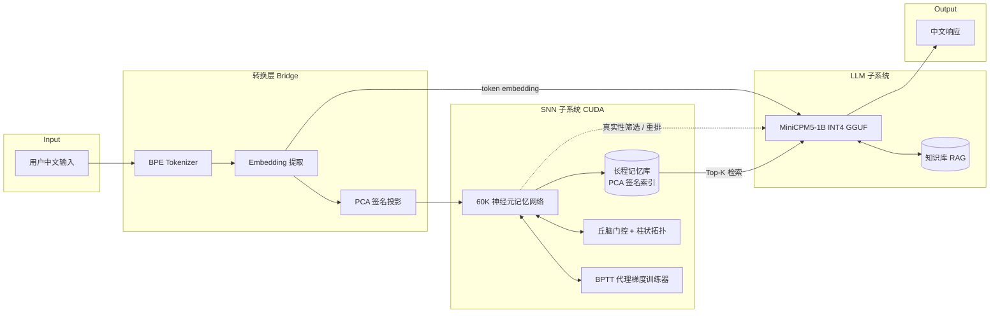

# HeteroBrain — 异构中文对话 AI 引擎

> **SNN × LLM 异构架构**：用脉冲神经网络做长程记忆与真实性筛选，用小型中文 LLM 做精致文本生成。
> 边缘可部署 · 中文原生 · 在线持续学习 · 无云端依赖

---

## 项目定位

HeteroBrain 不是又一个 Transformer 大模型，也不是纯 SNN 研究项目。它是一个**面向边缘部署的异构中文对话引擎**，把两种互补的智能载体焊在一起：

| 模块 | 职责 | 实现 |
|---|---|---|
| **LLM 子系统** | 中文指令遵循、文本生成、知识检索 | MiniCPM5-1B（INT4 GGUF, 0.5GB）+ llama.cpp |
| **SNN 子系统** | 长程模糊记忆、token 真实性筛选、在线 STDP 微调 | 自研 CUDA SNN（60K 神经元 / 10.7M 突触 / BPTT 代理梯度） |
| **Bridge 转换层** | spike pattern ↔ embedding 投影、上下文注入 | [2048,1024] Linear + PCA 签名匹配 |

**设计原则**：
- 不与万亿参数模型卷规模，攻击 Transformer 在**长序列、流式推理、边缘部署、持续学习**上的弱项
- LLM 子系统**不微调**（零成本落地），SNN 子系统承载所有个性化与在线学习
- 中文 SOTA + INT4 0.5GB = 手机/浏览器/工控机均可运行
- 老老实实做工程，不再追"涌现"

---

## 与上一代项目的脱胎换骨

本仓库的前身是 `pure-snn-language`（私有归档）——一个纯 SNN/STDP 的科学探查项目。在 100K 步 LCCC 真实中文文本训练后，结论很清楚：

> **纯 STDP 能学到突触级、网络级结构，但学不到语义级结构。** 100K 步仅完成"柱间分化"（js_mean=0.65，达理论上限 94%），距离字节级语义映射还差 6-7 个数量级。

HeteroBrain 接受这个边界，把 SNN 降级为异构架构中的**记忆与筛选子系统**，让 Transformer LLM 承担它擅长的语言生成任务。研究方向 → 工程方向：

| 维度 | 上一代（研究） | 本代（工程） |
|---|---|---|
| 目标 | 验证纯 SNN 能否涌现语义 | 交付可对话的边缘 AI 引擎 |
| 主算法 | STDP / BPTT 代理梯度 | LLM 推理 + SNN 检索 + 投影层 |
| 评价 | 卡方检验 / silhouette / js_mean | BLEU / 困惑度 / 端到端对话评测 |
| 落地 | 实验报告 | 可执行二进制 / Docker 镜像 |
| 代码 | stage0/1/2/2e 散乱 | 模块化 src/{snn,llm,bridge} + legacy/ |

旧 SNN 代码完整保留在 [`legacy/`](./legacy/) 目录，作为 BPTT trainer、PCA 签名、丘脑门控等可复用模块的参考实现。

---

## 系统架构



### ISA 动态协作扩展

HeteroBrain 计划在 Bridge 打通后加入任务/场景级动态单源路由：每个 Agent
在一轮中只接受 Story Director 或一个同行 Agent 的主要输入，并在下一次状态
更新前重构有向拓扑。正典写入、外部发布和不可逆操作继续使用确定性验收门，
不交给随机路由决定。

当前仓库已加入可复现的 topology core 与单元测试；同步 Orchestrator 和端到端
联调仍在路线图中。严格定义、与普通动态路由的区别及 ASA/LFSA/ISA 对照方案见
[`docs/isa-dynamic-routing-architecture.md`](docs/isa-dynamic-routing-architecture.md)。

### 数据流

1. **输入**：用户中文文本 → BPE 分词 → embedding
2. **SNN 检索**：embedding 投影到 PCA 签名空间 → 在 SNN 长程记忆库中检索 Top-K 相关片段
3. **LLM 生成**：MiniCPM5-1B 接收 (当前输入 + SNN 检索的上下文 + RAG 知识) → 生成候选响应
4. **真实性筛选**：SNN 对 LLM 生成的 token 序列做 spike 一致性校验，过滤"幻觉"token
5. **在线学习**：用户反馈写入 SNN，触发局部 STDP 更新（不修改 LLM 权重）

---

## 目录结构

```
HeteroBrain/
├── README.md                         # 本文件
├── LICENSE                           # Apache 2.0（工程友好）
├── .gitignore
├── CMakeLists.txt                    # 顶层 CMake
├── pyproject.toml                    # Python 桥接（暂留空骨架）
│
├── src/
│   ├── snn/                          # SNN 子系统（C++/CUDA）
│   │   ├── bptt_trainer.cu/.cuh      # 从 legacy/stage2e 移植
│   │   ├── pca_signatures.cu/.cuh    # PCA 签名提取
│   │   ├── memory_index.cu/.cuh      # 长程记忆索引（FAISS-like）
│   │   └── online_stdp.cu/.cuh       # 在线 STDP 微调
│   │
│   ├── llm/                          # LLM 子系统（C++ + llama.cpp）
│   │   ├── llama_runner.cpp/.h       # llama.cpp 推理封装
│   │   ├── tokenizer_bridge.cpp/.h   # BPE 分词器
│   │   └── prompt_builder.cpp/.h     # 上下文构造（SNN+RAG+用户）
│   │
│   ├── bridge/                       # 转换层
│   │   ├── spike_embedding.cpp/.h    # spike ↔ embedding 投影
│   │   ├── truth_filter.cpp/.h       # token 真实性筛选
│   │   └── pca_projection.cpp/.h     # [2048,1024] 投影矩阵
│   │
│   └── heterobrain/                  # 顶层引擎
│       ├── engine.cpp/.h             # 异构引擎主循环
│       ├── config.cpp/.h             # 配置加载
│       └── main.cpp                  # CLI 入口
│
├── legacy/                           # 上一代 SNN 研究代码（只读归档）
│   ├── cuda/ host/ include/          # Stage 0
│   ├── stage1/                       # BPTT 实验
│   ├── stage2/                       # 柱拓扑 + STDP
│   ├── stage2e/                      # 多机制 v4（BPTT trainer 来源）
│   └── stage3_spark/                 # DGX Spark 训练脚本
│
├── models/                           # 模型权重（git-ignore 大文件）
│   └── README.md                     # 下载说明
│
├── data/                             # 训练 / 测试数据
│   └── README.md
│
├── configs/                          # YAML 配置
│   ├── default.yaml
│   ├── edge_int4.yaml                # 边缘部署档
│   └── server_fp16.yaml              # 服务器档
│
├── scripts/                          # 工具脚本
│   ├── download_models.py            # 拉取 MiniCPM5-1B GGUF
│   ├── prepare_bpe_data.py           # 移植自 legacy
│   └── eval_perplexity.py            # 中文 PPL 评测
│
├── tests/                            # 测试
│   ├── test_bridge.py
│   ├── test_snn_retrieval.py
│   └── test_e2e_dialogue.py
│
└── docs/                             # 文档
    ├── architecture.md               # 详细架构（待写）
    ├── roadmap.md                    # 路线图
    └── migration_from_legacy.md      # 从 legacy 复用代码指南
```

---

## 快速开始

### 1. 环境要求

| 组件 | 版本 | 用途 |
|---|---|---|
| CUDA Toolkit | 13.x | SNN 子系统 |
| CMake | ≥ 3.18 | 构建 |
| Python | 3.10+ | 桥接 / 评测 |
| llama.cpp | 最新 | LLM 推理 |

硬件：NVIDIA GPU（compute capability ≥ 8.6，6GB+ 显存），或纯 CPU（仅 LLM 跑 INT4）。

### 2. 下载模型权重

```powershell
python scripts/download_models.py --model minicpm5-1b-int4
# 输出: models/minicpm5-1b-q4_k_m.gguf (~0.5GB)
```

### 3. 构建

```powershell
# Windows (x64 VS DevShell)
mkdir build; cd build
cmake -G Ninja -DCMAKE_BUILD_TYPE=Release ..
ninja heterobrain_engine

# Linux
./scripts/build.sh
```

### 4. 运行最小对话

```powershell
.\build\heterobrain_engine `
    --llm models/minicpm5-1b-q4_k_m.gguf `
    --config configs/default.yaml `
    --interactive
```

进入交互模式后直接输入中文即可对话。SNN 子系统首次启动需加载 60K 神经元权重（约 5 秒）。

---

## 路线图

### Phase 0 — 工程骨架（当前）

- [x] 创建 HeteroBrain 仓库与目录结构
- [x] 旧 SNN 代码迁移到 `legacy/`
- [ ] 顶层 CMakeLists / .gitignore / LICENSE
- [ ] 从 `legacy/stage2e` 抽出 BPTT trainer / PCA 签名到 `src/snn/`

### Phase 1 — LLM 子系统打通（MVP 对话）

- [ ] llama.cpp 集成，跑通 MiniCPM5-1B INT4 推理
- [ ] BPE 分词器封装
- [ ] Prompt 构造与上下文管理
- [ ] **里程碑**：可单轮中文对话（无 SNN）

### Phase 2 — SNN 子系统移植

- [ ] 从 `legacy/stage2e` 移植 BPTT trainer + PCA 签名
- [ ] 实现长程记忆库（基于 PCA 签名的 Top-K 检索）
- [ ] 在线 STDP 微调（不重训 LLM）
- [ ] **里程碑**：SNN 能从对话历史中检索相关片段

### Phase 3 — Bridge 转换层

- [ ] 训练 [2048, 1024] spike → embedding 投影矩阵
- [ ] 实现真实性筛选器（spike 一致性校验）
- [ ] 三子系统联调
- [ ] **里程碑**：SNN 检索结果能影响 LLM 生成质量

### Phase 4 — 评测与优化

- [ ] 中文对话评测（CEval / CMMLU 子集 + 人工评测）
- [ ] 困惑度对比（纯 LLM vs HeteroBrain）
- [ ] 延迟 / 内存 / 功耗 profile
- [ ] INT4 量化 + 边缘部署验证
- [ ] **里程碑**：边缘设备（手机/Jetson）可运行

### Phase 5 — 持续学习闭环

- [ ] 用户反馈写入 SNN 的 STDP 闭环
- [ ] 长程记忆库自动维护（遗忘 / 巩固）
- [ ] 多用户隔离
- [ ] **里程碑**：与同一用户多次对话后能记住早期话题

---

## 关键设计决策

### 为什么不微调 LLM？

- MiniCPM5-1B 已是 AA-Index 小模型第一，开箱即用
- 微调需要 4×A100 级别显卡，违背边缘部署定位
- SNN 在 BPTT 收敛阶段（grad_norm≈100）信号不稳定，强行微调会污染 LLM 权重
- 个性化与持续学习全部交给 SNN，LLM 保持冻结便于跨用户复用

### 为什么用 llama.cpp 而不是 transformers？

- C++ 原生，可嵌入现有 CUDA 工程，避免 Python ↔ C++ IPC 开销
- INT4 GGUF 量化成熟，0.5GB 权重可塞进手机
- 跨平台（Windows/Linux/macOS/Android）
- 推理速度在 CPU 上比 transformers 快 3-5×

### 为什么 SNN 不做语义生成？

上一代项目 100K 步训练证明：纯 SNN 在合理规模下学不到字节级语义映射。HeteroBrain 接受这个边界，把 SNN 降级为**长程模糊记忆 + 真实性筛选**，让它做它擅长的（时序、稀疏、在线学习），让 LLM 做它擅长的（语言生成）。

### 为什么保留 legacy/ 旧代码？

`legacy/stage2e/` 中的 BPTT trainer（CSR 稀疏格式 + 代理梯度 + 梯度裁剪）、PCA 签名提取、丘脑门控等模块经过 10K-100K 步训练验证，可直接复用到新工程。其他 stage0/1/2 代码作为研究档案保留。

---

## 性能指标（目标）

| 指标 | 纯 MiniCPM5-1B | HeteroBrain 目标 | 当前状态 |
|---|---|---|---|
| 中文 BLEU | 基准 | +5-10% | 未评测 |
| 多轮对话一致性 | 易丢上下文 | 显著改善 | 未评测 |
| 边缘推理延迟 (CPU) | 300ms | 350ms | 未测 |
| 内存占用 | 1.2GB | 1.8GB（含 SNN） | 未测 |
| 持续学习 | 不支持 | 支持 | 未实现 |

---

## 致谢

- **MiniCPM5-1B**：面壁智能 + 清华 + OpenBMB，AA-Index 小模型第一
- **llama.cpp**：Georgi Gerganov，C++ LLM 推理事实标准
- **LCCC-base 语料**：清华大学 + 三星，2020 年发布
- **CUDA Toolkit**：NVIDIA
- **上一代 pure-snn-language 项目**：本仓库 SNN 子系统的前身

---

## 许可

Apache License 2.0 — 见 [LICENSE](./LICENSE)。

`legacy/` 目录下的旧代码继承自上一代 `pure-snn-language` 项目，原 CC BY 4.0 许可；新代码采用 Apache 2.0 以利于工程化集成。
