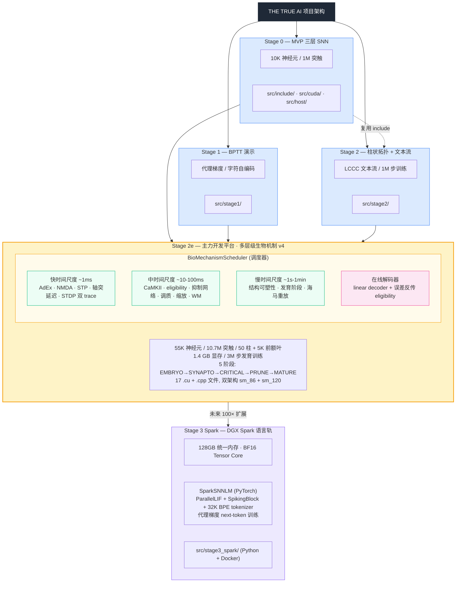

# THE TRUE AI — Code Wiki

> 结构化代码文档：项目整体架构 / 主要模块职责 / 关键类与函数说明 / 依赖关系 / 项目运行方式
>
> 维护对象：开发者与维护者。本文档与代码同步演进，描述截至 2026-07-26 的代码状态。
> 项目总览与科学结论见 [README.md](./README.md)。

---

## 目录

- [1. 项目整体架构](#1-项目整体架构)
  - [1.1 项目定位与设计哲学](#11-项目定位与设计哲学)
  - [1.2 多阶段代码分层架构](#12-多阶段代码分层架构)
  - [1.3 系统架构图](#13-系统架构图)
  - [1.4 数据流与控制流](#14-数据流与控制流)
- [2. 主要模块职责](#2-主要模块职责)
  - [2.1 Stage 0 — MVP 三层 SNN 管线](#21-stage-0--mvp-三层-snn-管线)
  - [2.2 Stage 1 — BPTT 与字符自编码器](#22-stage-1--bptt-与字符自编码器)
  - [2.3 Stage 2 — 柱状拓扑 + 文本流](#23-stage-2--柱状拓扑--文本流)
  - [2.4 Stage 2e — 多层级生物机制平台](#24-stage-2e--多层级生物机制平台)
  - [2.5 Stage 3 Spark — 下一代语言模型训练轨](#25-stage-3-spark--下一代语言模型训练轨)
- [3. 关键类与函数说明](#3-关键类与函数说明)
  - [3.1 Stage 0 核心类型与接口](#31-stage-0-核心类型与接口)
  - [3.2 Stage 2e 核心类型与调度器](#32-stage-2e-核心类型与调度器)
  - [3.3 Stage 2e CUDA Kernel 矩阵](#33-stage-2e-cuda-kernel-矩阵)
  - [3.4 Stage 3 Spark Python 模型](#34-stage-3-spark-python-模型)
- [4. 依赖关系](#4-依赖关系)
  - [4.1 模块间代码依赖](#41-模块间代码依赖)
  - [4.2 Stage 2e 内部依赖图](#42-stage-2e-内部依赖图)
  - [4.3 外部依赖](#43-外部依赖)
- [5. 项目运行方式](#5-项目运行方式)
  - [5.1 环境与硬件要求](#51-环境与硬件要求)
  - [5.2 编译构建](#52-编译构建)
  - [5.3 训练运行](#53-训练运行)
  - [5.4 Checkpoint 与恢复](#54-checkpoint-与恢复)
  - [5.5 分析工具](#55-分析工具)
- [6. 工程约定与硬约束](#6-工程约定与硬约束)
  - [6.1 编码与文件组织](#61-编码与文件组织)
  - [6.2 CUDA 实现关键约束](#62-cuda-实现关键约束)
  - [6.3 测试与 CI](#63-测试与-ci)

---

## 1. 项目整体架构

### 1.1 项目定位与设计哲学

**THE TRUE AI** 是一个从零自研的纯脉冲神经网络（SNN）语言习得实验项目。核心科学问题是：

> 在低参数成本下，纯局部学习规则（STDP）能否涌现出学习能力乃至语义理解？

设计哲学：

1. **零框架依赖** — 所有神经元模型、突触动力学、STDP、BPTT、分析工具链均从零自研，仅依赖 CUDA Toolkit / PyTorch / CMake / Ninja 等基础工具链。
2. **多阶段验证** — 按 Stage 0 → 1 → 2 → 2e → 3 的顺序递进，每阶段独立可验证，前阶段假设被证伪后引入新机制。
3. **生物机制分层叠加** — Stage 2e 按时间尺度（~1ms / ~10ms / ~100ms / ~1s / ~10s / ~1min / 长时）分层引入生物机制，避免一次性堆砌。
4. **诚实评估** — 每个"不能学到"的结论都是科学贡献，量化纯局部学习规则的真实能力边界。
5. **科学严格性** — 设置硬规则防止无限调参：每个改动必须对应生物机制假设、最多三档消融、必须设置负对照、中间指标不能当最终目标。

### 1.2 多阶段代码分层架构

项目按实验阶段将代码物理隔离到独立目录，每阶段有独立的 `CMakeLists.txt`、配置、入口与可执行目标，但允许复用下层稳定代码：

```
src/
├── include/          ← Stage 0 公共头文件（被 stage2 复用）
├── cuda/             ← Stage 0 核心 CUDA kernels
├── host/             ← Stage 0 Host 包装层与入口
├── scripts/          ← 构建/运行 PowerShell 脚本
├── stage1/           ← Stage 1: BPTT 实验（独立代码库）
├── stage2/           ← Stage 2: 柱状拓扑 + LCCC 文本流
├── stage2e/          ← Stage 2e: V4 多层级生物机制（主力开发）
└── stage3_spark/     ← Stage 3: DGX Spark 原生语言训练轨
```

**关键隔离规则**（项目硬约束）：

- Stage 0/1/2 是独立代码库，不共享实现代码；Stage 2 仅复用 Stage 0 的 `include/` 头文件与类型。
- Stage 2e 完全独立，不修改 stage0/1/2 任何源码，所有 v4 机制在 `src/stage2e/` 内实现。
- Stage 2e 的训练逻辑在 `unsupervised_trainer.cu`/`scheduler.cu`，**绝不修改 stage0 的 `trainer.cpp`**。
- Stage 3 Spark 代码隔离在 `src/stage3_spark/`，作为与 Stage 2e 生物局部学习实验分离的能力轨。

### 1.3 系统架构图



### 1.4 数据流与控制流

**Stage 0/2 训练数据流**：

```
LCCC-base JSONL (829MB)
    ↓ preprocess_lccc.py (JSON → 纯文本)
lccc_base.txt (UTF-8 字节流)
    ↓ text_stream.cu (流式读取)
每步: byte b = next_byte()
    ↓ one-hot 编码到 sensory 层
spike injection → STDP 学习 → homeostatic 调节
    ↓
checkpoint .bin (v2 格式)
    ↓ analyzer (PCA / K-means / 卡方 / 幂律)
结构分析报告
```

**Stage 2e 训练数据流**（核心循环）：

```
LCCC UTF-8 byte stream
    ↓ input_encoding.cu: 群体编码 + 柱字节偏好 + 门控增益
每步 step(t):
    [快时间尺度 ~1ms]
    delay_inject → input_inject → lif_adex → synapse_nmda
        → stdp_dual_trace → stdp_stp → delay_dispatch
    
    [中时间尺度 ~10-100ms, 每 N 步]
    (每10步)  CaMKII / eligibility / inhibitory_network
    (每100步) modulatory (DA/ACh/NE/5HT) / scaling / WM_update
              PCA_update / hippo_encode / coactivation_sample
              decode_step (在线解码器)
    
    [慢时间尺度 ~1s-1min, 每 N 步]
    (每1000步) structural_plasticity (CSR 重建)
               developmental (阶段切换)
    (每10000步) replay (海马重放)
    
    [周期性]
    (每 LOG_INTERVAL)  print_step_log
    (每 CHECKPOINT_INTERVAL)  save_checkpoint v3
    (收到 SIGINT/SIGTERM)  保存 checkpoint 退出
```

---

## 2. 主要模块职责

### 2.1 Stage 0 — MVP 三层 SNN 管线

**目标**：跑通 30 MB 显存的完整 STDP + homeostatic + reward 训练管线。

**目录**：[src/include/](src/include) + [src/cuda/](src/cuda) + [src/host/](src/host)

| 文件 | 职责 |
| --- | --- |
| [src/include/config.h](src/include/config.h) | 全局配置：10K 神经元 / 1M 突触 / 学习率 / STDP 参数 |
| [src/include/types.h](src/include/types.h) | `BrainRegion` 枚举、`NeuronState` / `Synapse` 结构 |
| [src/include/neuron.cuh](src/include/neuron.cuh) | LIF 神经元参数 (β=0.95, θ=1.0, refractory=2) |
| [src/include/synapse.cuh](src/include/synapse.cuh) | `Synapse` 结构 + `sync_weights()` |
| [src/include/stdp.cuh](src/include/stdp.cuh) | STDP 参数 (A±=0.05, τ±=20) |
| [src/include/network.h](src/include/network.h) | `SNNNetwork` 类接口（含 stage2 getter） |
| [src/include/network.cuh](src/include/network.cuh) | 网络内部接口 |
| [src/include/io.cuh](src/include/io.cuh) | `NetworkStats` + `compute_stats()` |
| [src/include/trainer.h](src/include/trainer.h) | stage0 trainer 接口 |
| [src/cuda/neuron_kernel.cu](src/cuda/neuron_kernel.cu) | LIF 更新 + homeostatic kernel |
| [src/cuda/stdp_kernel.cu](src/cuda/stdp_kernel.cu) | STDP + eligibility trace kernel |
| [src/cuda/synapse_kernel.cu](src/cuda/synapse_kernel.cu) | 突触传播 + 权重同步 kernel |
| [src/cuda/io_kernel.cu](src/cuda/io_kernel.cu) | 统计计算（meanFR / meanW）kernel |
| [src/cuda/network_init.cu](src/cuda/network_init.cu) | stage0 均匀随机拓扑生成（已被 stage2 替换） |
| [src/host/network.cpp](src/host/network.cpp) | `SNNNetwork` 类实现 |
| [src/host/io.cpp](src/host/io.cpp) | 权重保存/加载 |
| [src/host/monitor.cpp](src/host/monitor.cpp) | 训练监控 |
| [src/host/trainer.cpp](src/host/trainer.cpp) | stage0 训练器（stage2 不链接） |
| [src/host/main.cpp](src/host/main.cpp) | stage0 入口 |

### 2.2 Stage 1 — BPTT 与字符自编码器

**目标**：从零实现 BPTT + 代理梯度，验证梯度正确性（20/20 通过，max rel_err 1.5e-6），跑通字符自编码器（32/32 round-trip fidelity 100%）。

**目录**：[src/stage1/](src/stage1) — 独立代码库，不依赖 stage0。

| 文件 | 职责 |
| --- | --- |
| [src/stage1/CMakeLists.txt](src/stage1/CMakeLists.txt) | 构建配置（BPTT + text_codec） |
| [src/stage1/bptt_kernels.cu](src/stage1/bptt_kernels.cu) / [.cuh](src/stage1/bptt_kernels.cuh) | BPTT 前向/反向 kernel |
| [src/stage1/bptt_demo.cu](src/stage1/bptt_demo.cu) | 梯度检查 demo |
| [src/stage1/text_codec.cu](src/stage1/text_codec.cu) / [.cuh](src/stage1/text_codec.cuh) | 5-bit 字符编码（已被 stage2 的 8-bit 取代） |
| [src/stage1/main.cpp](src/stage1/main.cpp) | 字符自编码器入口 |

### 2.3 Stage 2 — 柱状拓扑 + 文本流

**目标**：用真正的皮层柱拓扑（10 柱 × 1000 神经元，柱内三层流水线）替代 stage0 的均匀随机连接，加载 LCCC-base 真实中文语料，跑 1M 步训练。

**目录**：[src/stage2/](src/stage2) — 复用 stage0 的 `include/`，不修改 stage0 源码。

| 文件 | 职责 |
| --- | --- |
| [src/stage2/CMakeLists.txt](src/stage2/CMakeLists.txt) | 构建 `snn_stage2` + `snn_stage2_analyze`，链接 stage0 的 4 .cu + 3 .cpp（排除 network_init.cu / trainer.cpp / main.cpp） |
| [src/stage2/config.h](src/stage2/config.h) | stage2 配置（柱参数 / 字节→柱映射 / 8-bit 编码 / 训练步数） |
| [src/stage2/columnar_topology.cu](src/stage2/columnar_topology.cu) / [.cuh](src/stage2/columnar_topology.cuh) | 10 柱拓扑生成器（p_intra=0.1, p_inter=0.005） |
| [src/stage2/text_codec_ext.cu](src/stage2/text_codec_ext.cu) / [.cuh](src/stage2/text_codec_ext.cuh) | 8-bit UTF-8 字节编码（替代 stage1 的 5-bit） |
| [src/stage2/text_stream.cu](src/stage2/text_stream.cu) / [.cuh](src/stage2/text_stream.cuh) | LCCC 语料流式读取 |
| [src/stage2/unsupervised_trainer.cu](src/stage2/unsupervised_trainer.cu) / [.cuh](src/stage2/unsupervised_trainer.cuh) | 训练循环 + checkpoint I/O（v2 格式） |
| [src/stage2/competition.cu](src/stage2/competition.cu) / [.cuh](src/stage2/competition.cuh) | k-WTA 柱间竞争（手工机制，已被纯 SNN 实验证伪） |
| [src/stage2/analyzer.cu](src/stage2/analyzer.cu) / [.cuh](src/stage2/analyzer.cuh) | PCA / K-means / 卡方 / 幂律 / silhouette 分析 |
| [src/stage2/analyze_main.cpp](src/stage2/analyze_main.cpp) | 分析入口（`--ckpt` / `--random` / `--csv`） |
| [src/stage2/main.cpp](src/stage2/main.cpp) | 训练入口（`--steps` / `--text` / `--ckpt`） |
| [src/stage2/preprocess_lccc.py](src/stage2/preprocess_lccc.py) | LCCC JSON → 纯文本预处理 |

### 2.4 Stage 2e — 多层级生物机制平台

**目标**：在 5.5×10⁴ 神经元 / 1.07×10⁷ 突触 / 50 柱规模上叠加多层级生物机制（AdEx / NMDA / STP / PSW / Ca²⁺回弹 / CaMKII / 丘脑门控 / 皮层层级 / 树突区室化 / 前额叶-工作记忆），跑完整 3M 步发育训练。

**目录**：[src/stage2e/](src/stage2e) — 完全独立，不修改 stage0/1/2。

| 文件 | 职责 |
| --- | --- |
| [src/stage2e/CMakeLists.txt](src/stage2e/CMakeLists.txt) | 构建配置：双架构 `CUDA_ARCHITECTURES "86;120"`，目标 `snn_stage2e_p1` + 工具 + 测试 |
| [src/stage2e/config.h](src/stage2e/config.h) | v4 全参数（55K 神经元 / 10.7M 突触 / 50 柱 / AdEx / NMDA / STP / STDP / PSW / Ca²⁺ / CaMKII / 调质 / 丘脑门控 / WM / PCA / 海马） |
| [src/stage2e/types.h](src/stage2e/types.h) | `NeuronStateAdEx` (56B) / `BioSynapse` (80B) / `HippoIndex` (256B) / `CoactTracker` (16B) / `WMSlot` (216B) |
| [src/stage2e/memory_allocator.cu](src/stage2e/memory_allocator.cu) / [.cuh](src/stage2e/memory_allocator.cuh) | 1.33 GB GPU 缓冲池管理（`PersistentBuffers` + `MemoryAllocator` 类） |
| [src/stage2e/network_init.cu](src/stage2e/network_init.cu) / [.cuh](src/stage2e/network_init.cuh) | 50 柱拓扑生成 + 1/√K 平衡态缩放 + PSW 初始化 + 50 非重叠柱偏好 |
| [src/stage2e/neuron_kernels.cu](src/stage2e/neuron_kernels.cu) / [.cuh](src/stage2e/neuron_kernels.cuh) | AdEx 神经元更新 + 适应性 + 阈值动态 + 延迟队列注入/分发 |
| [src/stage2e/synapse_kernels.cu](src/stage2e/synapse_kernels.cu) / [.cuh](src/stage2e/synapse_kernels.cuh) | NMDA + AMPA + GABA + STP + STDP 双 trace + 树突区室化 + Ca²⁺ 回弹 LTD |
| [src/stage2e/input_encoding.cu](src/stage2e/input_encoding.cu) / [.cuh](src/stage2e/input_encoding.cuh) | 群体编码 + 柱字节偏好 + 门控增益 + LCCC UTF-8 文本流加载 |
| [src/stage2e/thalamic_gate.cu](src/stage2e/thalamic_gate.cu) / [.cuh](src/stage2e/thalamic_gate.cuh) | 丘脑-皮层门控（模块 D）：活动补偿 + novelty 增强 |
| [src/stage2e/modulatory_kernels.cu](src/stage2e/modulatory_kernels.cu) / [.cuh](src/stage2e/modulatory_kernels.cuh) | DA/ACh/NE/5HT 神经调质 + PSW 概率突触权重 + Ca²⁺ 回弹 + CaMKII |
| [src/stage2e/coactivation_kernels.cu](src/stage2e/coactivation_kernels.cu) / [.cuh](src/stage2e/coactivation_kernels.cuh) | 共激活跟踪采样 + 淘汰 + 衰减 + 结构可塑性批量重建 + CSR 重建 + 完整性校验 |
| [src/stage2e/pca_kernels.cu](src/stage2e/pca_kernels.cu) / [.cuh](src/stage2e/pca_kernels.cuh) | PCA 增量学习（Oja's rule）+ 签名提取 + 全量反投影 |
| [src/stage2e/hippocampal_kernels.cu](src/stage2e/hippocampal_kernels.cu) / [.cuh](src/stage2e/hippocampal_kernels.cuh) | 海马索引编码 + top-K 选取 + 重放后衰减 + 时间衰减 + 睡眠重放周期 |
| [src/stage2e/wm_kernels.cu](src/stage2e/wm_kernels.cu) / [.cuh](src/stage2e/wm_kernels.cuh) | 工作记忆写入（新颖检测 + LRU）+ 维持（衰减 + PCA 反投影注入前额叶） |
| [src/stage2e/decode_kernels.cu](src/stage2e/decode_kernels.cu) / [.cuh](src/stage2e/decode_kernels.cuh) | 在线线性解码器：前向 + softmax + argmax + 误差反传 eligibility + 权重归一化 |
| [src/stage2e/decoder.cu](src/stage2e/decoder.cu) / [.cuh](src/stage2e/decoder.cuh) | 解码器辅助逻辑 |
| [src/stage2e/scheduler.cu](src/stage2e/scheduler.cu) / [.cuh](src/stage2e/scheduler.cuh) | **核心**：`BioMechanismScheduler` 类，多时间尺度流水线调度 |
| [src/stage2e/scheduler_checkpoint.cu](src/stage2e/scheduler_checkpoint.cu) | checkpoint v3 保存/加载/清理（section-based, magic 'SNN2ECP3'） |
| [src/stage2e/ckpt_v3.h](src/stage2e/ckpt_v3.h) | checkpoint v3 格式定义（`CkptV3Reader` / `CkptV3Section`） |
| [src/stage2e/run_config.cpp](src/stage2e/run_config.cpp) / [.h](src/stage2e/run_config.h) | 命令行配置解析（`RunConfig` 结构 + `parse_run_config()`） |
| [src/stage2e/main.cpp](src/stage2e/main.cpp) | P1 训练入口（`--steps` / `--csv` / `--e0` + 字节解读报告 + SIGINT 处理） |
| [src/stage2e/inspect_ckpt.cpp](src/stage2e/inspect_ckpt.cpp) | checkpoint 检查工具（导出 buffer 数据） |
| [src/stage2e/decoder_main.cpp](src/stage2e/decoder_main.cpp) | 解码器独立入口 |
| [src/stage2e/tools/inspect_checkpoint.py](src/stage2e/tools/inspect_checkpoint.py) | Python checkpoint 检查工具（无需 CUDA） |
| [src/stage2e/tests/run_config_test.cpp](src/stage2e/tests/run_config_test.cpp) | `RunConfig` 解析单元测试 |
| [src/stage2e/tests/test_source_contracts.py](src/stage2e/tests/test_source_contracts.py) | 源码契约检查（硬约束验证） |
| [src/stage2e/tests/test_checkpoint_inspector.py](src/stage2e/tests/test_checkpoint_inspector.py) | checkpoint 检查工具测试 |
| [src/stage2e/build_p1.ps1](src/stage2e/build_p1.ps1) / [.sh](src/stage2e/build_p1.sh) | Windows / Linux 构建脚本 |
| [src/stage2e/run_train.sh](src/stage2e/run_train.sh) | Linux/DGX Spark 训练启动脚本（前台/后台 nohup） |
| [src/stage2e/analyze_burst.py](src/stage2e/analyze_burst.py) | 簇状发放分析 |
| [src/stage2e/analyze_profile.py](src/stage2e/analyze_profile.py) | 显存/性能 profile 分析 |
| [src/stage2e/eval_perplexity.py](src/stage2e/eval_perplexity.py) | 解码器 perplexity 评估 |
| [src/stage2e/show_decode_effect.py](src/stage2e/show_decode_effect.py) | 解码效果可视化 |

### 2.5 Stage 3 Spark — 下一代语言模型训练轨

**目标**：与 Stage 2e 生物局部学习实验分离的能力轨。在 DGX Spark 上用 PyTorch + 代理梯度优化 next-token cross entropy，使用并行无重置 LIF 积分器映射到 Blackwell Tensor Core。

**目录**：[src/stage3_spark/](src/stage3_spark)

| 文件 | 职责 |
| --- | --- |
| [src/stage3_spark/README.md](src/stage3_spark/README.md) | Stage 3 设计说明、LCCC 准备、烟雾测试、Spark v5 配置、恢复运行 |
| [src/stage3_spark/train.py](src/stage3_spark/train.py) | **核心**：`SparkSNNLM` PyTorch 模型 + 训练循环 + checkpoint + 评估 |
| [src/stage3_spark/prepare_lccc.py](src/stage3_spark/prepare_lccc.py) | LCCC JSONL → 纯文本流式语料转换 |
| [src/stage3_spark/run_train.sh](src/stage3_spark/run_train.sh) | Docker 容器启动脚本（拒绝重复容器，防止意外中断活跃训练） |

---

## 3. 关键类与函数说明

### 3.1 Stage 0 核心类型与接口

#### `SNNNetwork` 类（[src/include/network.h](src/include/network.h) / [src/host/network.cpp](src/host/network.cpp)）

Stage 0 网络管理类，封装 GPU 资源与训练循环。

```cpp
class SNNNetwork {
public:
    SNNNetwork(int seed = 42);
    ~SNNNetwork();

    // 训练入口
    void train(int steps, const std::string& text_path);
    
    // stage2 getter（暴露内部缓冲供 stage2 trainer 使用）
    NeuronState* neurons_device();
    Synapse*     synapses_device();
    // ...
    
    // 统计
    NetworkStats compute_stats();
    
    // Checkpoint I/O
    void save_checkpoint(const std::string& path);
    void load_checkpoint(const std::string& path);
};
```

#### `NeuronState` / `Synapse` 结构（[src/include/types.h](src/include/types.h)）

Stage 0 基础数据类型，被 stage2 复用：

- `NeuronState`：LIF 神经元状态（membrane_potential / fire_rate / threshold_offset / last_spike_time / refractory_remaining）
- `Synapse`：32B 突触（pre_idx / post_idx / weight / last_pre_spike / last_post_spike / eligibility）
- `BrainRegion` 枚举：SENSORY / ASSOCIATION / MOTOR

#### CUDA Kernel 函数（[src/cuda/](src/cuda)）

| Kernel | 职责 |
| --- | --- |
| `lif_update_kernel` | LIF 神经元更新 + homeostatic 阈值调节 |
| `stdp_kernel` | STDP 权重更新 + eligibility trace |
| `synapse_propagate_kernel` | 突触电流传播 + 权重同步 |
| `compute_stats_kernel` | meanFR / meanW 统计 |

### 3.2 Stage 2e 核心类型与调度器

#### `NeuronStateAdEx` 结构（[src/stage2e/types.h](src/stage2e/types.h)，56B）

AdEx（Adaptive Exponential Integrate-and-Fire）神经元状态，对齐 8 字节边界：

```cpp
struct NeuronStateAdEx {
    // 基础电生理 (20B)
    float membrane_potential;       // V_norm ∈ [-0.5, 1.5]
    float synaptic_current;         // AMPA + GABA 输入
    float nmda_current;             // NMDA 电压依赖电流
    float adaptive_conductance;     // AdEx 适应电导 w
    int   last_spike_time;
    
    // 放电统计 (12B)
    float fire_rate;                // 滑动平均发放率
    int   refractory_remaining;
    float ca_neuron;                // 神经元级钙浓度
    
    // 类型与分区 (8B)
    uint8_t  neuron_type;           // 0=兴奋, 1=抑制
    uint8_t  region;                // 0=L4, 1=L2/3, 2=L5, 3=L6, 4=前额叶, 5=运动皮层
    uint8_t  inhibitory_subtype;    // FS / LTS / SOM
    uint8_t  column_id;             // 0..49 或 255=前额叶
    int16_t  pf_group_id;           // 前额叶组 ID (-1=非前额叶)
    uint16_t threshold_offset;      // 定点阈值偏移 (实际 = /256.0f)
    
    // WM 注入 + 缩放 (8B)
    float wm_injection;             // 工作记忆注入电流
    float homeostatic_factor;       // 局部突触缩放因子
    
    int _reserved; int _pad;        // padding 到 56B
};
```

#### `BioSynapse` 结构（[src/stage2e/types.h](src/stage2e/types.h)，80B）

生物突触，包含神经调质受体与多时间尺度状态：

```cpp
struct BioSynapse {
    // 0-15: 基础连接
    int   pre_idx, post_idx;
    float weight;                   // 兴奋>0, 抑制<0
    float delay_steps;              // 轴突延迟步数 (v4 强化 I)
    
    // 16-31: STDP 双 trace (v4 强化 J)
    float last_pre_spike, last_post_spike;
    float x_pre_trace, x_post_trace;
    
    // 32-47: 电导 + 钙
    float nmda_conductance, ampa_conductance;
    float ca_concentration;         // LTP/LTD 开关
    float resource;                 // STP 资源 R
    
    // 48-63: Eligibility + 缩放
    float eligibility;              // 1 阶 trace
    float eligibility_slow;         // 2 阶慢 trace (v3 强化 H)
    float utilization;              // STP 利用率 U
    float scaling_factor;           // 局部突触缩放
    
    // 64-79: CaMKII + 调质受体 (v3 强化 B + v4 强化 K)
    float camkii_autophosph;        // 自磷酸化水平 [0,1]
    float da_receptor;              // DA 受体密度 (D1+/D2-)
    float ach_receptor;             // ACh 受体密度
    uint8_t receptor_flags;         // AMPA|NMDA|GABA_A|GABA_B
    uint8_t ne_receptor_u8;         // NE 受体 (定点 /127.0f)
    uint8_t ht5_receptor_u8;        // 5HT 受体
    uint8_t _pad;
};
```

#### `HippoIndex` / `CoactTracker` / `WMSlot` 结构

- `HippoIndex` (256B)：海马索引条目，含 50 维 PCA 签名 + importance + replay_count + pattern_start_step
- `CoactTracker` (16B)：共激活跟踪器，含 candidate_pre（16+16 位编码神经元对）+ coact_count + modulator_score + last_seen
- `WMSlot` (216B)：工作记忆槽位，含 pattern[50] + activation + age + bound_pf_group

#### `MemoryAllocator` 类（[src/stage2e/memory_allocator.cuh](src/stage2e/memory_allocator.cuh)）

管理 Stage 2e 全部持久 GPU 缓冲池（1.33 GB）：

```cpp
struct PersistentBuffers {
    // 神经元 (55K × 56B = 3.08 MB)
    NeuronStateAdEx* d_neurons;
    bool*            d_spike_flags;
    
    // 突触 (10.7M × 80B = 856 MB)
    BioSynapse* d_synapses;
    int*        d_csr_row_ptr;        // 55,001 × 4B
    int*        d_csr_col_idx;        // 10.7M × 4B
    float*      d_weights_cache;      // d_synapses.weight 镜像
    float*      d_eligibility;        // 1 阶
    float*      d_eligibility_slow;   // 2 阶 (v3 强化 H)
    
    // PSW 概率突触权重 (10.7M × 4B × 2 = 85.6 MB)
    float* d_synapse_alpha;           // LTP 证据累积
    float* d_synapse_beta;            // LTD 证据累积
    
    // PCA / 海马 / WM / 解码器 / 调质 / 共激活 ...
};

class MemoryAllocator {
public:
    explicit MemoryAllocator(size_t budget_bytes = DEFAULT_VRAM_BUDGET_MB * 1024ULL * 1024ULL);
    size_t allocate_all();
    void   free_all();
    PersistentBuffers& buffers();
    bool   check_budget() const;
    void   print_budget_report() const;
    // ...
};
```

#### `BioMechanismScheduler` 类（[src/stage2e/scheduler.cuh](src/stage2e/scheduler.cuh)）

**核心调度器**，编排所有 CUDA kernel 与多时间尺度流水线：

```cpp
class BioMechanismScheduler {
public:
    BioMechanismScheduler(MemoryAllocator* alloc);
    
    // 主步进函数（每步调用，内部按时间尺度分发）
    void step(int current_step);
    
    // E0 消融模式: 关闭三因素调制 + CaMKII + 调质系统 (纯 STDP 基线)
    bool e0_ablation = false;
    
    // 在线解码接口
    bool  decode_update_weights = true;
    float decode_lr = DECODE_LEARNING_RATE;
    void  decode_step(uint8_t current_input_byte, bool is_inject_step, bool update_weights);
    float get_last_decode_loss() const;
    int   get_last_predicted_byte() const;
    float get_decode_avg_loss() const;
    float get_decode_perplexity() const;
    float get_decode_accuracy() const;
    
    // 统计
    const NetworkStats2e& stats() const;
    
private:
    // 快时间尺度 kernel launchers
    void launch_delay_inject(int step);
    void launch_input_inject(int step);
    void launch_lif_adex(int step);
    void launch_synapse_nmda(int step);
    void launch_stdp_dual_trace(int step);
    void launch_stdp_stp(int step);
    void launch_delay_dispatch(int step);
    
    // 中时间尺度 kernel launchers
    void launch_camkii_kernel(int step);           // 每 10 步
    void launch_stdp_eligibility(int step);        // 每 10 步
    void launch_inhibitory_network(int step);      // 每 10 步
    void launch_modulatory(int step);              // 每 100 步
    void launch_scaling(int step);                 // 每 100 步
    void launch_wm_update(int step);               // 每 100 步
    void launch_pca_update(int step);              // 每 100 步
    void launch_hippo_encode(int step);            // 每 100 步
    void launch_coactivation_sample(int step);     // 每 100 步
    void launch_decode_step(int step);             // 每步（前向）+ 注入步（更新）
    
    // 慢时间尺度 kernel launchers
    void launch_structural_plasticity(int step);   // 每 1000 步
    void launch_developmental(int step);           // 每 1000 步
    void launch_replay(int step);                  // 每 10000 步
    void launch_semantic_eval(int step);
    
    // 日志与阶段切换
    void print_step_log(int step);
    void print_phase_change(int step, DevPhase new_phase);
};
```

#### `DevPhaseTable` 与发育阶段（[src/stage2e/scheduler.cuh](src/stage2e/scheduler.cuh)）

5 个发育阶段参数表，模拟生物脑发育过程：

```cpp
struct DevPhaseTable {
    DevPhaseParams phases[5];
    // phases[0] = EMBRYO    (0 - 5K)      — 缩短加速涌现验证
    // phases[1] = SYNAPTO   (5K - 200K)   — plast_gain 5.0→1.0 防饱和
    // phases[2] = CRITICAL  (200K - 800K) — 关键期可塑性最高
    // phases[3] = PRUNE     (800K - 1.5M) — 修剪期
    // phases[4] = MATURE    (1.5M - 3M)   — 成熟期
    
    DevPhase get_phase(int step) const;
    const DevPhaseParams& get_params(int step) const;
};
```

#### `RunConfig` 结构（[src/stage2e/run_config.h](src/stage2e/run_config.h)）

命令行配置集中管理：

```cpp
struct RunConfig {
    int      total_steps = 10000;
    int      device = 0;
    uint32_t seed = 42;
    uint64_t memory_budget_mb = DEFAULT_VRAM_BUDGET_MB;
    int      checkpoint_interval = 50000;
    int      keep_checkpoints = 3;
    bool     e0_mode = false;             // 纯 STDP 消融基线
    bool     synthetic_input = false;     // 0..255 循环输入（烟雾测试）
    bool     strict_criteria = false;     // 科学判据未通过时返回非零
    bool     show_help = false;
    std::string text_path = "data/lccc_sample_1mb.txt";
    std::string csv_path;
    std::string checkpoint_dir = "checkpoints";
    std::string resume_path;
    // 在线解码评估参数
    float    decode_lr = 0.001f;
    bool     eval_mode = false;           // 仅推理模式
    std::string eval_text_path;           // held-out 评估文本
};

bool parse_run_config(int argc, char** argv, RunConfig* config, std::string* error);
```

#### Checkpoint v3 格式（[src/stage2e/ckpt_v3.h](src/stage2e/ckpt_v3.h) / [scheduler_checkpoint.cu](src/stage2e/scheduler_checkpoint.cu)）

section-based 布局，支持完整状态恢复：

- **Magic**: `SNN2ECP3`
- **Footer**: `SN2EOK3`
- **Version**: 3
- 包含：完整 `d_synapses_`（32MB 含 STDP 状态，非仅 `d_weights_`）+ 调度器状态 + 文本游标 + 种子
- 写入：临时文件 + CRC32 payload 校验 + 同目录原子改名
- 自动轮转：仅保留最近 N 个 checkpoint
- SIGINT/SIGTERM 信号优雅退出

### 3.3 Stage 2e CUDA Kernel 矩阵

#### 神经元 Kernels（[src/stage2e/neuron_kernels.cuh](src/stage2e/neuron_kernels.cuh)）

| Kernel | 职责 | 启动配置 |
| --- | --- | --- |
| `launch_delay_inject` | 把上一轮延迟电流注入 input_current | 按神经元数 grid |
| `launch_lif_adex` | AdEx 神经元更新（适应性+阈值动态+不应期） | 按神经元数 grid |
| `launch_delay_dispatch` | 按突触 delay_steps 把 pre 脉冲分发到环形队列 | 按突触数 grid |
| `finish_delay_dispatch` | 延迟队列分发同步 | host 端 |

#### 突触 Kernels（[src/stage2e/synapse_kernels.cuh](src/stage2e/synapse_kernels.cuh)）

| Kernel | 职责 | 调用频率 |
| --- | --- | --- |
| `launch_synapse_nmda` | NMDA 受体电压依赖 + Mg²⁺ block + Ca²⁺ 浓度更新 | 每步 |
| `launch_stdp_dual_trace` | STDP 双 trace (Bi & Poo 2001) + 树突区室化 Ca²⁺ 回弹 LTD | 每步 |
| `launch_stdp_stp` | 短期可塑性 STP (Tsodyks-Markram 1998) | 每步 |
| `launch_camkii` | CaMKII 自磷酸化动力学 (Graupner & Brunel 2012) | 每 10 步 |
| `launch_stdp_eligibility` | 2 阶 eligibility trace 更新 | 每 10 步 |
| `launch_synaptic_scaling` | 局部突触缩放（homeostatic） | 每 100 步 |

#### 调质 Kernels（[src/stage2e/modulatory_kernels.cuh](src/stage2e/modulatory_kernels.cuh)）

| Kernel | 职责 |
| --- | --- |
| `launch_modulatory_update` | DA/ACh/NE/5HT 浓度更新 + 突触级受体激活 |
| `launch_psw_update` | PSW 概率突触权重更新（Beta(α,β) 分布） |
| `launch_calcium_rebound_ltd` | Ca²⁺ 回弹 LTD（前馈连接独立 Ca²⁺ 动力学） |
| `launch_camkii_consolidation` | CaMKII 分子巩固 |

#### 丘脑门控（[src/stage2e/thalamic_gate.cuh](src/stage2e/thalamic_gate.cuh)）

| Kernel | 职责 |
| --- | --- |
| `launch_thalamic_gate` | 丘脑-皮层门控：活动补偿（低活跃时增强）+ novelty 增强（新颖输入增益） |

#### PCA Kernels（[src/stage2e/pca_kernels.cuh](src/stage2e/pca_kernels.cuh)）

| Kernel | 数学 | 启动配置 |
| --- | --- | --- |
| `pca_update_kernel` | Oja's rule: `W[:,k] += η·(x - W[:,k]·sig)·sig` | grid=(K,), block=256 |
| `pca_encode_kernel` | `sig[k] = Σ_i W[i,k]·(fr[i]-mean[i])`, L2 归一化 | 1 block, K threads |
| `pca_back_project_kernel` | `recon[i] = mean[i] + Σ_k sig[k]·W[i,k]` | grid=ceil(N/256), block=256 |

#### 海马 Kernels（[src/stage2e/hippocampal_kernels.cuh](src/stage2e/hippocampal_kernels.cuh)）

| Kernel | 职责 |
| --- | --- |
| `hippo_encode_kernel` | 海马索引编码（cosine 匹配 + 新颖性判定 + LRU 写入） |
| `hippo_get_top_k_kernel` | top-K 索引选取（partial selection sort + selected bitmap） |
| `hippo_decay_importance_kernel` | 重放后 importance *= HIPP_REPLAY_DECAY, replay_count++ |
| `hippo_time_decay_kernel` | 时间衰减（所有索引 importance *= HIPP_TIME_DECAY） |
| `replay_inject_kernel` | 重放电流注入（PCA 反投影重建 × inject_gain） |
| `launch_replay_cycle` | 完整重放周期：top-K → 反投影 → 注入 → 衰减 |

#### 共激活与结构可塑性 Kernels（[src/stage2e/coactivation_kernels.cuh](src/stage2e/coactivation_kernels.cuh)）

| Kernel | 职责 |
| --- | --- |
| `launch_coactivation_sample` | 每步采样候选对，更新/创建 CoactTracker |
| `launch_coactivation_prune` | 淘汰长期未活跃 tracker |
| `launch_coactivation_decay` | coact_count 与 modulator_score 衰减 |
| `structural_rebuild_kernel` | 候选生成（新突触）+ 修剪标记（弱突触） |
| `csr_rebuild_kernel` | 分块原地 CSR 重建（Phase A/B/C） |
| `launch_csr_rebuild` | host wrapper（含 5% 判定 + CPU 端构建 row_ptr/remap_table） |
| `csr_integrity_check_kernel` | 重建后校验（row_ptr 单调性 + col_ind 范围 + 总数一致） |
| `launch_csr_rebuild_with_integrity_check` | 带 CSR 完整性校验的重建（失败时回滚） |

#### 工作记忆 Kernels（[src/stage2e/wm_kernels.cuh](src/stage2e/wm_kernels.cuh)）

| Kernel | 职责 |
| --- | --- |
| `wm_write_kernel` | 新颖检测（cosine 相似度）+ LRU 替换写入 |
| `wm_maintain_kernel` | 衰减 + PCA 反投影重建发放率注入前额叶组 |

#### 解码器 Kernels（[src/stage2e/decode_kernels.cuh](src/stage2e/decode_kernels.cuh)）

| Kernel | 数学 | 启动配置 |
| --- | --- | --- |
| `decode_forward_kernel` | `logits[b] = Σ_i W[i*256+b]·spike[i]` | 1 block, 256 threads |
| `decode_softmax_kernel` | 数值稳定 in-place softmax | 1 block, 256 threads |
| `decode_argmax_kernel` | argmax reduction | 1 block, 256 threads |
| `decode_error_kernel` | `error[b] = p[b] - one_hot(target)`, cross-entropy loss | 1 block, 256 threads |
| `decode_weight_update_kernel` | `ΔW = -η·error·spike_flags` | grid=ceil(N/256), block=256 |
| `decode_weight_normalize_kernel` | 行 L2 归一化（||w_i|| ≤ 1） | grid=N, block=256 |
| `decode_eligibility_update_kernel` | 误差反传到神经元级 eligibility | grid=ceil(N/256), block=256 |

### 3.4 Stage 3 Spark Python 模型

#### `SurrogateSpike` 类（[src/stage3_spark/train.py](src/stage3_spark/train.py)）

代理梯度脉冲函数，让脉冲网络的不可微阈值函数可反向传播：

```python
class SurrogateSpike(torch.autograd.Function):
    @staticmethod
    def forward(ctx, membrane):
        ctx.save_for_backward(membrane)
        return (membrane > 0).to(membrane.dtype)
    
    @staticmethod
    def backward(ctx, grad_output):
        (membrane,) = ctx.saved_tensors
        return grad_output / (1.0 + membrane.abs()).square()
```

#### `ParallelLIF` 类

并行无重置 LIF 积分器，用 cumsum 替代时间步循环，暴露全序列给 CUDA：

```python
class ParallelLIF(nn.Module):
    def __init__(self, width, threshold=1.0):
        # 4 个固定时间常数 [0.90, 0.95, 0.98, 0.99] 提供短/长记忆带
        bands = torch.tensor([0.90, 0.95, 0.98, 0.99])
        beta = bands.repeat_interleave((width + 3) // 4)[:width]
        self.threshold = nn.Parameter(torch.full((width,), threshold))
    
    def forward(self, current):
        # 并行前缀和: membrane = cumsum(current / powers) * powers
        # FP32 积分保证长时间常数数值稳定性, 周围投影保持 BF16
        return spike(membrane - self.threshold)
```

#### `SpikingBlock` / `SparkSNNLM` 类

```python
class SpikingBlock(nn.Module):
    # norm → in_proj(2*d_ff) → chunk(current, gate) → LIF → out_proj → dropout → residual
    def forward(self, x):
        current, gate = self.in_proj(self.norm(x)).chunk(2, dim=-1)
        spikes = self.lif(current)
        x = x + self.dropout(self.out_proj(spikes * torch.sigmoid(gate)))
        return x, spikes.mean()

class SparkSNNLM(nn.Module):
    def __init__(self, vocab, seq_len, d_model, d_ff, layers, dropout):
        self.token_embedding    = nn.Embedding(vocab, d_model)
        self.position_embedding = nn.Parameter(torch.zeros(seq_len, d_model))
        self.blocks             = nn.ModuleList([SpikingBlock(...) for _ in range(layers)])
        self.norm               = nn.RMSNorm(d_model)
        self.lm_head            = nn.Linear(d_model, vocab, bias=False)
        self.lm_head.weight     = self.token_embedding.weight  # weight tying
    
    def forward(self, tokens):
        x = self.token_embedding(tokens) + self.position_embedding[:seq_len]
        rates = []
        for block in self.blocks:
            x, rate = block(x)
            rates.append(rate)
        return self.lm_head(self.norm(x)), torch.stack(rates).mean()
```

#### 关键函数

| 函数 | 职责 |
| --- | --- |
| `build_tokenizer(corpus, output, vocab_size)` | 训练 32K BPE tokenizer（ByteLevel pre-tokenizer + decoder） |
| `load_tokens(corpus, tokenizer, ...)` | 加载/缓存 token 流（mmap int32，含 corpus/tokenizer 元数据校验） |
| `sample_batch(tokens, batch, seq_len, device)` | 随机采样训练 batch（start + seq_len+1 offsets） |
| `split_tokens(tokens, seq_len, val_fraction)` | 训练/验证集切分（不相交连续区间） |
| `evaluate(model, tokens, ...)` | 验证集 loss + spike_rate 评估 |
| `generate_sample(model, tokenizer, prompt, ...)` | top-k 采样生成续写 |
| `save_checkpoint(output, step_id, model, optimizer, ...)` | 原子 checkpoint 保存（tmp + os.replace） |

---

## 4. 依赖关系

### 4.1 模块间代码依赖

```
Stage 0 (src/include, src/cuda, src/host)
    ↑ 复用 include/ 头文件
Stage 2 (src/stage2) — 链接 stage0 的 4 .cu + 3 .cpp
    (排除 network_init.cu, trainer.cpp, main.cpp)

Stage 1 (src/stage1)        — 完全独立
Stage 2e (src/stage2e)      — 完全独立（不依赖 stage0/1/2 源码）
Stage 3 Spark (src/stage3_spark) — 完全独立 Python 项目
```

**硬约束**（项目记忆）：

- Stage 0/1/2 是独立代码库，无共享实现代码；Stage 2 仅复用 Stage 0 的 `include/` 头文件。
- Stage0 和 stage1 是分离代码库，无共享实现代码；stage2 只能复用 stage1 的 text_codec（已被 stage2e 废弃）。
- Stage 2e 完全独立，不修改 stage0/1/2 任何源码。
- Stage2 的 `CMakeLists.txt` 必须链接 stage0 的 4 .cu 和 3 .cpp 文件，排除 `network_init.cu` / `trainer.cpp` / `main.cpp`。
- Stage 2e 的训练逻辑在 `unsupervised_trainer.cu`/`scheduler.cu`，**绝不修改 stage0 的 `trainer.cpp`**。
- Stage 3 Spark 代码隔离在 `src/stage3_spark/`，作为与 Stage 2e 生物局部学习实验分离的能力轨。

### 4.2 Stage 2e 内部依赖图

```
config.h ← types.h ← memory_allocator.cuh ← scheduler.cuh
                ↑              ↑                    ↑
                │              │                    ├← thalamic_gate.cuh
                │              │                    ├← decode_kernels.cuh
                │              │                    ├← neuron_kernels.cuh
                │              │                    ├← synapse_kernels.cuh
                │              │                    ├← modulatory_kernels.cuh
                │              │                    ├← coactivation_kernels.cuh
                │              │                    ├← pca_kernels.cuh
                │              │                    ├← hippocampal_kernels.cuh
                │              │                    └← wm_kernels.cuh
                │              │
                │              └← network_init.cuh
                │              └← input_encoding.cuh
                │
                └← run_config.h
                   ↑
                   main.cpp ← scheduler.cuh + network_init.cuh + input_encoding.cuh
                                       ↓
                            scheduler_checkpoint.cu (ckpt v3)
                            ckpt_v3.h

工具链:
   inspect_ckpt.cpp ← ckpt_v3.h + scheduler internals
   decoder_main.cpp ← decoder.cuh
   tools/inspect_checkpoint.py ← ckpt v3 格式（无 CUDA 依赖）

测试:
   tests/run_config_test.cpp ← run_config.h
   tests/test_source_contracts.py ← 源码契约静态检查
   tests/test_checkpoint_inspector.py ← tools/inspect_checkpoint.py
```

### 4.3 外部依赖

#### 编译工具链

| 依赖 | 版本 | 用途 |
| --- | --- | --- |
| CUDA Toolkit | 13.x（13.3 测试通过） | GPU 编译与运行 |
| CMake | ≥ 3.18 | 构建系统 |
| Ninja | 任意（推荐） | 比 MSBuild 快 3-5× 的构建器 |
| Visual Studio 2022 Build Tools | MSVC v143, x64 | Windows 编译器 |
| GCC | 11+ | Linux 编译器 |

#### 运行时库

| 依赖 | 用途 |
| --- | --- |
| CUDA Runtime | GPU 内核调度 |
| `std::filesystem` (C++17) | 跨平台目录创建（替代 Windows `_mkdir`） |
| Python 3 | Stage 3 Spark + 分析工具 + checkpoint 检查 |
| PyTorch | Stage 3 Spark 训练框架 |
| `tokenizers` (HuggingFace) | Stage 3 BPE tokenizer |
| Docker | Stage 3 Spark 容器化运行 |

#### 数据依赖

| 数据 | 来源 | 用途 |
| --- | --- | --- |
| LCCC-base | 清华+三星 2020, [thu-coai/CDial-GPT](https://github.com/thu-coai/CDial-GPT), 829MB / 2016 万对话轮次 | 中文 UTF-8 字节流训练语料 |
| LCCC-base (HuggingFace 镜像) | `silver/lccc` dataset, MIT 许可 | Stage 3 Spark 全量训练 |

#### 硬件依赖

| 平台 | 用途 |
| --- | --- |
| NVIDIA GPU, compute capability ≥ 8.6 (RTX 30/40/A 系列) | Stage 0/1/2/2e 训练 |
| NVIDIA GPU, compute capability ≥ 12.0 (Blackwell DGX Spark GB10) | Stage 2e 大规模训练 + Stage 3 Spark |
| 显存 ≥ 6 GB | Stage 2e 55K 神经元 / 10.7M 突触配置 |
| 显存 ≥ 32 GB | Stage 2e DGX Spark 默认训练预算 |
| 内存 ≥ 16 GB | 829MB LCCC 语料加载 |

---

## 5. 项目运行方式

### 5.1 环境与硬件要求

详见 [4.3 外部依赖](#43-外部依赖)。关键提醒：

> ⚠️ **中文路径注意（Windows）**：CUDA 13.3 在中文路径下需要用 x64 cl.exe（不能用默认的 x86）。启动 VS DevShell 时必须加 `-HostArch amd64 -Arch amd64` 参数，否则 `cudafe++` 会崩溃。

### 5.2 编译构建

#### 5.2.1 Stage 0 / 1 / 2（Windows）

```powershell
# 1. 启动 x64 VS DevShell（关键：必须 x64 避免 cudafe++ 崩溃）
$vsPath = "C:\Program Files (x86)\Microsoft Visual Studio\2022\BuildTools"
Import-Module "$vsPath\Common7\Tools\Microsoft.VisualStudio.DevShell.dll"
Enter-VsDevShell -VsInstallPath $vsPath -SkipAutomaticLocation `
    -DevCmdArguments "-arch=x64 -host_arch=x64"

# 2. 构建 Stage 0/1/2（在 src/ 或子目录下）
cd "f:\项目\THE TRUE AI\src\stage2"
mkdir build; cd build
cmake -G Ninja ..
ninja snn_stage2 snn_stage2_analyze

# 3. 验证
.\snn_stage2.exe --help
.\snn_stage2_analyze.exe --help
```

#### 5.2.2 Stage 2e（Windows）

```powershell
cd "f:\项目\THE TRUE AI\src\stage2e"
.\build_p1.ps1     # 自动配置 x64 VS DevShell + cmake -G Ninja + ninja snn_stage2e_p1

# 或手动:
mkdir build; cd build
cmake -G Ninja ..
ninja snn_stage2e_p1
```

#### 5.2.3 Stage 2e（Linux / DGX Spark）

```bash
cd pure-snn-language
src/stage2e/build_p1.sh  # 自动发现 /usr/local/cuda；无 Ninja 时回退到 Make
```

#### 5.2.4 双架构支持

`src/stage2e/CMakeLists.txt` 配置 `CUDA_ARCHITECTURES "86;120"`，同一份二进制同时支持：

- **sm_86**：RTX 30/40/A 系列（Ampere/Ada）
- **sm_120**：DGX Spark GB10（Blackwell）

本地 sm_86 编译验证通过，DGX Spark sm_120 可直接运行同一二进制。

#### 5.2.5 Stage 3 Spark（Docker）

```bash
# 镜像 flux-train:latest 需预先构建（含 PyTorch + tokenizers）
# run_train.sh 拒绝重复容器，防止意外中断活跃训练
src/stage3_spark/run_train.sh --steps 20 --d-model 512 ...  # 烟雾测试
```

### 5.3 训练运行

#### 5.3.1 Stage 2e 训练命令

```bash
# 烟雾测试（10K 步）
src/stage2e/build/snn_stage2e_p1 --steps 10000 \
  --text data/lccc_sample_1mb.txt --checkpoint-interval 0

# 完整 3M 步发育训练（每 50K 完整 checkpoint，默认保留最近 3 个）
src/stage2e/run_train.sh 3000000 bg
tail -f src/stage2e/training_3000000.log

# 从 800K checkpoint 恢复（--steps 是绝对停止步数）
src/stage2e/run_train.sh 3000000 bg \
  src/stage2e/checkpoints/ckpt_step800000.snn2e

# E0 消融基线（纯 STDP，关闭三因素+CaMKII+调质）
src/stage2e/build/snn_stage2e_p1 --steps 10000 --e0

# 评估模式（输出 spike 序列 CSV）
src/stage2e/build/snn_stage2e_p1 --steps 10000 --csv p1_profile.csv

# LCCC 真实文本训练（100K 步）
src/stage2e/build/snn_stage2e_p1 --steps 100000
```

#### 5.3.2 Stage 2e 命令行参数

`snn_stage2e_p1` 接受的参数（[src/stage2e/run_config.h](src/stage2e/run_config.h)）：

| 参数 | 默认值 | 说明 |
| --- | --- | --- |
| `--steps N` | 10000 | 绝对停止步数；恢复到 800K 后传 3M，表示继续到 3M |
| `--text PATH` | `data/lccc_sample_1mb.txt` | UTF-8 字节语料；恢复时大小和 FNV-1a 指纹必须匹配 |
| `--seed N` | 42 | 拓扑种子；checkpoint 会记录并在恢复时还原 |
| `--device N` | 0 | CUDA device 序号 |
| `--memory-budget-mb N` | `DEFAULT_VRAM_BUDGET_MB` | 显存预算（MB） |
| `--checkpoint-dir PATH` | `checkpoints` | 完整 checkpoint 输出目录 |
| `--checkpoint-interval N` | 50000 | 保存间隔，`0` 禁用 |
| `--keep-checkpoints N` | 3 | 保留最新 N 个，`0` 不清理 |
| `--resume PATH` | — | 恢复 `.snn2e` 完整状态 |
| `--e0` | false | E0 消融模式（纯 STDP 基线） |
| `--synthetic-input` | false | 显式启用 `0..255` 循环输入，仅用于烟雾测试 |
| `--strict-criteria` | false | 科学判据未全部通过时返回非零 |
| `--csv PATH` | — | 输出 spike 序列 CSV（评估模式） |
| `--eval-text-path PATH` | — | held-out 评估文本路径 |
| `--decode-lr FLOAT` | 0.001 | 解码学习率 |
| `--eval-mode` | false | 仅推理模式（不更新 W_decode） |

#### 5.3.3 Stage 3 Spark 训练命令

```bash
# Spark v5 初始配置
src/stage3_spark/run_train.sh --steps 10000 --d-model 1536 --d-ff 4096 \
  --layers 12 --batch-size 8 --seq-len 256 --compile \
  --corpus data/lccc_base_train.txt \
  --tokenizer src/stage3_spark/tokenizer_lccc_base_32k.json \
  --token-cache src/stage3_spark/token_cache_lccc_base_32k.bin \
  --checkpoint-interval 250 --eval-interval 100

# 恢复训练
src/stage3_spark/run_train.sh --steps 10000 --d-model 1536 --d-ff 4096 \
  --layers 12 --batch-size 8 --seq-len 256 --compile \
  --corpus data/lccc_base_train.txt \
  --tokenizer src/stage3_spark/tokenizer_lccc_base_32k.json \
  --token-cache src/stage3_spark/token_cache_lccc_base_32k.bin \
  --resume src/stage3_spark/runs/spark_v5/checkpoint_250.pt
```

#### 5.3.4 LCCC 语料准备

```bash
# Stage 2/2e: LCCC JSON → 纯文本
python src/stage2/preprocess_lccc.py \
    --input path/to/LCCC-base-split/train.json \
    --output data/lccc_base.txt

# 生成 1MB 样本用于分析
python -c "
data = open('data/lccc_base.txt','rb').read()[:1048576]
open('data/lccc_sample_1mb.txt','wb').write(data)
"

# Stage 3 Spark: LCCC JSONL.gz → 纯文本（流式）
curl -L --fail --retry 5 -C - \
  https://huggingface.co/datasets/silver/lccc/resolve/main/lccc_base_train.jsonl.gz \
  -o data/lccc_base_train.jsonl.gz
echo "2162e0ed923fba62329cabf7e1493fbe59248afc94a62508e4abdea61e624627  data/lccc_base_train.jsonl.gz" \
  | sha256sum -c -
python3 src/stage3_spark/prepare_lccc.py \
  --input data/lccc_base_train.jsonl.gz \
  --output data/lccc_base_train.txt
```

### 5.4 Checkpoint 与恢复

#### Stage 2e v3 Checkpoint 格式

- **Magic**: `SNN2ECP3`
- **Footer**: `SN2EOK3`
- **Version**: 3
- **布局**: section-based（通过 `CkptV3Reader::find_section()` 查找，非硬编码偏移）
- **内容**:
  - 完整 `d_synapses_`（32MB，含 STDP 状态），**非仅 `d_weights_`**
  - 调度器状态（发育阶段 / 步数 / 延迟队列索引）
  - 文本游标（恢复时校验 FNV-1a 指纹）
  - 种子持久化（确保拓扑一致性）
- **写入**: 临时文件 → CRC32 payload 校验 → 完成 footer → 同目录原子改名
- **轮转**: 自动保留最近 N 个 checkpoint（默认 3，`--keep-checkpoints` 配置）
- **信号**: 收到 `SIGINT`/`SIGTERM` 时先保存再退出

无需 CUDA 即可检查 checkpoint 完整性：

```bash
python src/stage2e/tools/inspect_checkpoint.py \
  src/stage2e/checkpoints/ckpt_step800000.snn2e --verify
```

完整的分阶段门禁、科学对照与运维边界见 [docs/spark-training-plan.md](docs/spark-training-plan.md)。

#### Stage 3 Spark Checkpoint

- 原子保存（tmp + `os.replace`）
- 内容：model state_dict + optimizer state_dict + global step + tokens_seen + vocab + args
- 恢复时校验 vocab 一致性
- Token cache 也原子保存，含 corpus 路径/大小/时间戳/tokenizer 哈希/vocab 元数据校验

### 5.5 分析工具

#### Stage 2 分析工具

```powershell
# 结构分析（PCA / K-means / 卡方 / 幂律 / silhouette）
.\snn_stage2_analyze.exe `
    --ckpt  data\stage2_pure_1M_ckpt.bin `
    --text  data\lccc_sample_1mb.txt `
    --steps 10000 `
    --label "Pure-SNN-1M" `
    --csv   data\stage2_pure_1M_clusters.csv

# 随机基线对比
.\snn_stage2_analyze.exe `
    --random `
    --text  data\lccc_sample_1mb.txt `
    --steps 10000 `
    --label "B1-Random" `
    --csv   data\stage2_b1_random_clusters.csv
```

#### Stage 2e 分析工具

```bash
# checkpoint 检查（导出 buffer 数据，无需 CUDA）
src/stage2e/build/inspect_ckpt src/stage2e/checkpoints/ckpt_step100000.snn2e

# Python 检查工具（无 CUDA 依赖，校验完整性）
python src/stage2e/tools/inspect_checkpoint.py \
  src/stage2e/checkpoints/ckpt_step800000.snn2e --verify

# 簇状发放分析
python src/stage2e/analyze_burst.py src/stage2e/p1_profile.csv

# 显存/性能 profile 分析
python src/stage2e/analyze_profile.py src/stage2e/p1_profile.csv

# 解码器 perplexity 评估
python src/stage2e/eval_perplexity.py ...

# 解码效果可视化
python src/stage2e/show_decode_effect.py ...
```

---

## 6. 工程约定与硬约束

### 6.1 编码与文件组织

| 约定 | 说明 |
| --- | --- |
| 源码编码 | UTF-8 无 BOM，含中文注释；MSVC 必须显式 `/utf-8`，CUDA 用 `-Xcompiler=/utf-8` |
| C++ 标准 | C++17（`CMAKE_CXX_STANDARD 17`） |
| CUDA 标准 | C++17（`CMAKE_CUDA_STANDARD 17`） |
| 跨平台路径 | 使用 `std::filesystem::create_directories` 替代 Windows `_mkdir`，条件编译 `_WIN32` 头文件 |
| Stage 隔离 | Stage 0/1/2/2e/3 各自独立目录，互不修改源码 |
| 工具代码 | `inspect_ckpt` / `decoder` 用 `CkptV3Reader::find_section()` section 查找，非硬编码偏移 |
| 测试 | `run_config_test.cpp` + `test_source_contracts.py` 验证配置与源码契约 |

### 6.2 CUDA 实现关键约束

| 约束 | 原因 |
| --- | --- |
| **STDP kernel 必须先计算 `delta_w` 再更新 `last_pre_spike`/`last_post_spike`** | 否则 LTP 永远不触发，所有突触单调归零（曾导致学习失败） |
| **抑制性突触 clamp 到 `[-W_MAX, 0]` 而非 `[0, 1]`** | 防止权重归零 |
| **80/20 兴奋/抑制比例在每层内独立维持** | 生物合理性 |
| **运动皮层稳态目标发放率 (30Hz) 高于感觉/联合 (5Hz)** | 不同脑区功能差异 |
| **CUDA 13.3 必须指定 `-HostArch amd64 -Arch amd64`** | 加载 x64 cl.exe 避免 cudafe++ 崩溃（中文路径） |
| **`CUDA_CHECK_2E` 宏强制检查 `cudaMalloc`/`cudaMemset`/`cudaMemcpy`** | 早期发现显存错误 |
| **Checkpoint 保存完整 `d_synapses_`（32MB 含 STDP 状态）而非 `d_weights_`** | 确保训练恢复拓扑一致性 |
| **前馈连接独立 Ca²⁺ 动力学**（`NMDA_CA_TAU_FEEDFORWARD=10.0f`, `CA_MAX_FEEDFORWARD=0.12f < CA_REBOUND_THRESHOLD=0.15f`） | 防止 Ca²⁺ 回弹 LTD 摧毁前馈权重（修复 L5/L6 chi² 停滞） |
| **权重保存直接从 `d_weights_` 拷贝** | 避免 heap corruption |
| **网络输出用 fire_rate 滑动平均，非原始 spike count** | 平滑统计 |
| **`d_synapses_` 与 `d_weights_` 在初始化和每次 `step()` 后同步** | 数据一致性 |
| **外部输入上传到持久 `d_external_buf_` 设备缓冲后再注入** | 避免重复分配 |
| **文本编解码函数必须在 host (`__host__`) 上运行** | 不污染 GPU 内核 |
| **文本输入编码为 `float[2000]`，仅前 8 神经元（对应 8-bit byte）激活，其余 1992 神经元为 0** | 字节级编码约定 |
| **Ca²⁺ 回弹 LTD 对前馈连接必须禁用** | 防止权重摧毁 |
| **主循环训练完成后必须保存最终 checkpoint**（即使 total_steps 不是 checkpoint interval 的倍数） | 防止训练成果丢失 |
| **Checkpoint 格式必须用 v3 section-based**（magic `SNN2ECP3`, footer `SN2EOK3`, version 3） | 替代 v2 固定偏移格式，支持扩展 |
| **Checkpoint 必须包含种子持久化** | 训练恢复拓扑一致性 |
| **Checkpoint 必须实现自动轮转**（仅保留最近 N 个） | 防止磁盘占满 |
| **训练必须支持 SIGINT/SIGTERM 信号优雅退出**（带 checkpoint 保存） | 长训练可中断恢复 |
| **训练必须支持 `--resume` 从 checkpoint 恢复** | 长训练可分段执行 |
| **命令行配置必须集中在 `run_config.h/cpp`** | 统一参数管理 |
| **Linux 可移植性** | 用 `std::filesystem::create_directories` 替代 `_mkdir`，`_WIN32` 条件编译 |
| **Stage 2e 必须支持跨平台编译** | `CMakeLists.txt` 配置 `CUDA_ARCHITECTURES '86;120'`（RTX 3060 + DGX Spark GB10） |
| **Stage 3 Spark 代码必须隔离在 `src/stage3_spark/`** | 与 Stage 2e 生物局部学习实验分离 |

### 6.3 测试与 CI

| 测试 | 文件 | 用途 |
| --- | --- | --- |
| 配置解析单元测试 | [src/stage2e/tests/run_config_test.cpp](src/stage2e/tests/run_config_test.cpp) | `RunConfig` 解析正确性 |
| 源码契约检查 | [src/stage2e/tests/test_source_contracts.py](src/stage2e/tests/test_source_contracts.py) | 静态检查硬约束（如 STDP 顺序、抑制突触 clamp 范围） |
| Checkpoint 检查工具测试 | [src/stage2e/tests/test_checkpoint_inspector.py](src/stage2e/tests/test_checkpoint_inspector.py) | `inspect_checkpoint.py` 正确性 |
| Host 语法检查 | [src/stage2e/tests/host_syntax_check.ps1](src/stage2e/tests/host_syntax_check.ps1) | 不依赖 CUDA 的 host 代码语法检查 |
| Stage 1 BPTT 梯度检查 | [src/stage1/bptt_demo.cu](src/stage1/bptt_demo.cu) | 20/20 通过，max rel_err 1.5e-6 |

#### 防止无限调参的硬规则

> 详见 [人脑差距模块评估 §17](docs/superpowers/specs/2026-07-24-human-brain-gap-module-assessment.md)

1. 每个改动必须对应一个生物机制假设，不能只写"提升 col_ratio/silhouette"
2. 每个参数最多三档消融：baseline、biologically plausible、extreme boundary
3. 失败后停止该方向：三档均无效时，不继续搜索参数，转向假设审查
4. 必须设置负对照：随机字节、打乱标签、打乱柱偏好、held-out corpus
5. 中间指标不能当最终目标：spike/step、col_ratio、silhouette 只是结构指标，不等于语义
6. 语义结论必须依赖泛化行为：held-out 序列、next-token/byte 预测、简单问答或检索行为
7. 活动区间已达标后冻结：除非后续结构改动导致 A 回归，否则不再调输入增益

---

## 附录：相关文档索引

| 文档 | 内容 |
| --- | --- |
| [README.md](README.md) | 项目总览、核心结论、架构、阶段划分、目录结构、复现指南 |
| [全量神经元模拟对话智能-总纲.md](全量神经元模拟对话智能-总纲.md) | 新方向奠基性总纲：结构同构假设、SNN 全量模拟、对话主目标、阶段路线图与停损点 |
| [全量神经元模拟对话智能-工程落地方案.md](全量神经元模拟对话智能-工程落地方案.md) | 项目最初规划（包含 stage0/1/2/3 的整体设计） |
| [阶段2-联合皮层发育-实施规划.md](阶段2-联合皮层发育-实施规划.md) | Stage 2 详细实施规划 v3（含 2a/2b/2c/2d 子阶段） |
| [stage2b-训练结果分析报告.md](stage2b-训练结果分析报告.md) | 1M 步训练结果分析（指标定义、演化轨迹、5 大关键发现） |
| [stage2c-结构分析报告.md](stage2c-结构分析报告.md) | 结构分析报告（PCA / K-means / 卡方 / 幂律，4 个判定标准） |
| [人类脑差距评估.md](人类脑差距评估.md) | 与人脑的规模 / 机制 / 功能 / 物理实现差距评估（10-15 个数量级） |
| [stage2e-100k-训练指标报告.md](stage2e-100k-训练指标报告.md) | Stage 2e 100K 步训练完整指标 |
| [Stage2e_3M_训练结果分析报告_2026-07-26.md](Stage2e_3M_训练结果分析报告_2026-07-26.md) | Stage 2e 3M 步训练结果分析 |
| [项目综合成果报告.md](项目综合成果报告.md) | 项目综合成果报告（实验目的、阶段性失败、修改措施、当前成果总结） |
| [项目全面报告.md](项目全面报告.md) | 项目全面报告 |
| [DGX-Spark部署整理报告.md](DGX-Spark部署整理报告.md) | DGX Spark 128GB 平台部署报告 |
| [docs/superpowers/specs/2026-07-19-bio-mechanisms-design.md](docs/superpowers/specs/2026-07-19-bio-mechanisms-design.md) | Stage 2e 多层级生物机制设计 v4 |
| [docs/superpowers/specs/2026-07-24-human-brain-gap-module-assessment.md](docs/superpowers/specs/2026-07-24-human-brain-gap-module-assessment.md) | 人脑差距模块评估：14 个模块评级 + Phase R1-R5 路线图 + 防止无限调参硬规则 |
| [docs/spark-training-plan.md](docs/spark-training-plan.md) | DGX Spark 训练实施方案（分阶段门禁、科学对照与运维边界） |
| [.trae/specs/](.trae/specs/) | 已实施 spec（add-thalamic-gating / add-dendritic-compartmentalization / boost-activity-and-column-ratio / boost-column-differentiation / fix-architectural-issues / complete-v4-residual-mechanisms / fix-byte-identity-discrimination / fix-calcium-rebound-ltd / fix-feedforward-layer-weights / fix-l5-l6-chi2-stagnation / fix-stp-continuous-recovery / fix-stp-depression / add-cortical-layer-hierarchy / add-language-motor-cortex 共 14 个） |

---

**文档维护**：本文档与代码同步演进，描述截至 2026-07-26 的代码状态。如发现与代码不一致，请以代码为准并提交 PR 更新本文档。
