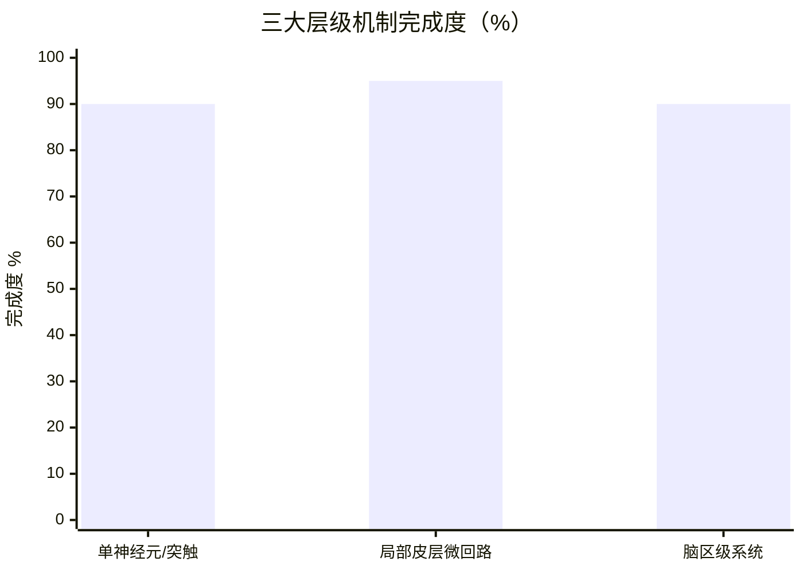
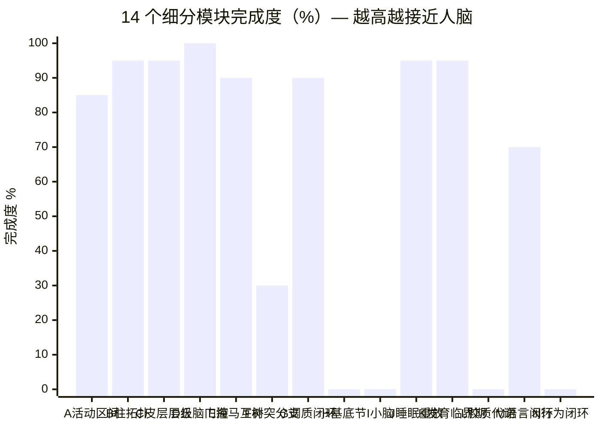
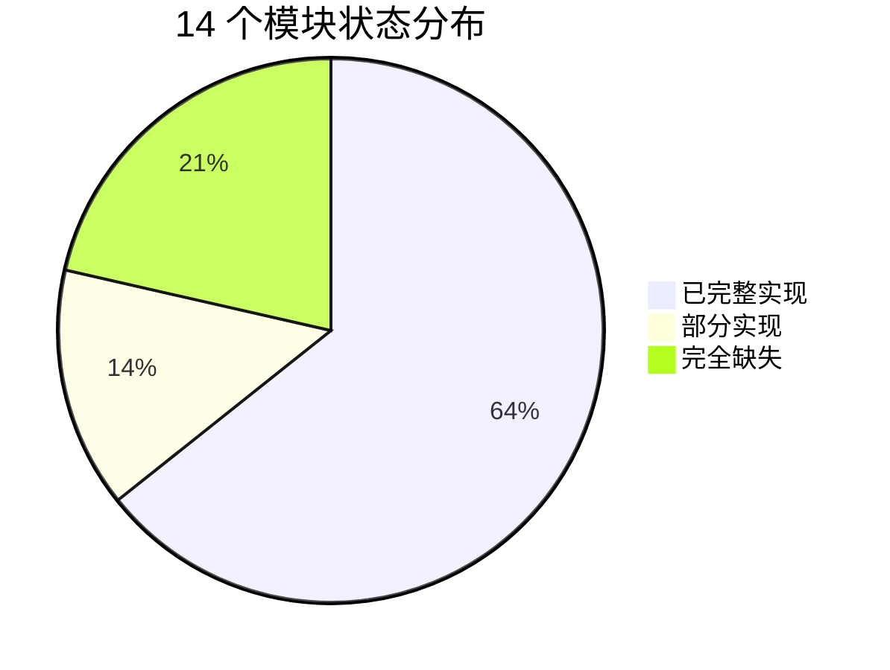
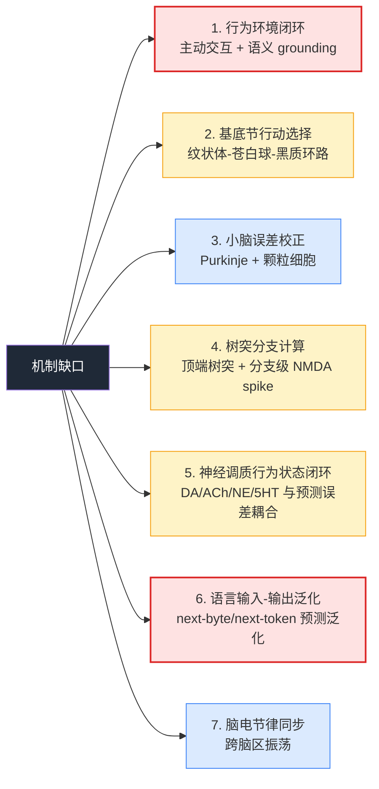
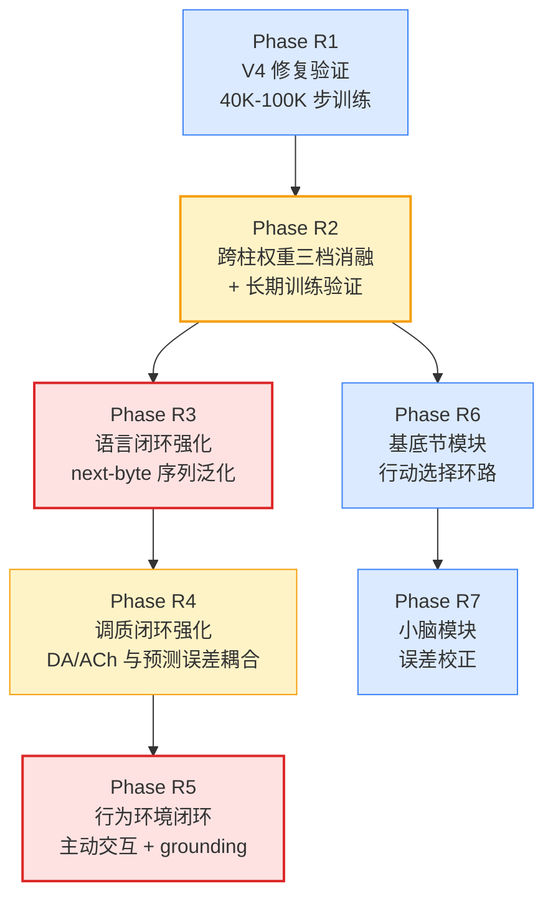

# THE TRUE AI 距离真实人脑的机制差距评估（重写版）

**评估日期**：2026-07-26
**评估依据**：基于 Stage 2e 实际代码（含 `fix/v4-mechanism-p0-p1-p2-bugs` 分支，commit `1df2170`）逐行核查，非设计文档推断
**前置说明**：旧评估文档（2026-07-24）已归档至 [docs/archive/human-brain-gap-assessment-2026-07-24/](file:///f:/项目/THE%20TRUE%20AI/docs/archive/human-brain-gap-assessment-2026-07-24/)，旧评估因基于 spec 文档而非实际代码，对真实皮层层级、丘脑门控等模块严重低估

---

## 一、规模差距（量级）

| 维度 | THE TRUE AI (Stage 2e) | 真实人脑 | 差距量级 |
|---|---|---|---|
| 神经元数 | 60,000（55K 联合皮层 + 5K 前额叶） | ~8.6×10¹⁰ | **1.4×10⁶ 倍** |
| 突触数 | 10.7M（含前额叶自反馈 + 跨柱） | ~10¹⁴ | **~10⁷ 倍** |
| 每神经元突触数 | ~200 出度 | 1,000-10,000 | **5-50 倍** |
| 模拟时间步 | 1ms 离散 | 连续时间，亚毫秒级 | — |
| 训练步数 | 3M steps ≈ 50 分钟模拟时间 | 数十年连续运行 | **10⁶ 倍** |
| 显存 | 1.4 GB（RTX 3060 6GB / DGX Spark 32GB） | 人脑 ~20 W 功耗 | — |

**规模差距结论**：约 **6-7 个数量级**。但项目设计哲学是"机制验证优先于规模扩张"——即使在 60K 神经元规模上验证机制假设，也比盲目扩展到 86B 神经元但无机制更有价值。

---

## 二、机制差距（核心）

### 2.1 已实现机制清单（基于代码逐行核查）

#### A. 单神经元/突触机制

| 机制 | 实现位置 | 完成度 |
|---|---|---|
| AdEx 神经元模型（Brette & Gerstner 2005） | [neuron_kernels.cu](file:///f:/项目/THE%20TRUE%20AI/src/stage2e/neuron_kernels.cu), [config.h#L101-L158](file:///f:/项目/THE%20TRUE%20AI/src/stage2e/config.h#L101-L158) | ✅ 100% |
| 适应电导 + 阈值动态（钠通道失活） | config.h#L147-L158 | ✅ 100% |
| AMPA / NMDA / GABA_A / GABA_B 四种受体 | [synapse_kernels.cu](file:///f:/项目/THE%20TRUE%20AI/src/stage2e/synapse_kernels.cu), config.h#L121-L142 | ✅ 100% |
| NMDA 电压依赖 Mg²⁺ 阻断（Jahr & Stevens 1990） | synapse_kernels.cu | ✅ 100% |
| 短期可塑性 STP（Tsodyks-Markram 1998） | synapse_kernels.cu, config.h#L161-L177 | ✅ 100% |
| 前馈连接易化型 STP（Thomson & Bannister 2003） | config.h#L170-L177 | ✅ 100% |
| STDP 双 trace（Bi & Poo 2001） | synapse_kernels.cu, config.h#L236-L242 | ✅ 100% |
| PSW 概率突触权重（贝叶斯 STDP，自然元可塑性） | synapse_kernels.cu, config.h#L244-L277 | ✅ 100% |
| Ca²⁺ 回弹 LTD（Yang et al. 1999, BCM 分子基础） | synapse_kernels.cu, config.h#L280-L297 | ✅ 100% |
| CaMKII 分子巩固（Graupner & Brunel 2012） | synapse_kernels.cu, config.h#L327-L333 | ✅ 100% |
| 2 阶 eligibility trace（快/慢） | synapse_kernels.cu, config.h#L299-L301 | ✅ 100% |
| 树突区室化（前馈连接基底树突独立 Ca²⁺ 动力学） | [config.h#L124-L128](file:///f:/项目/THE%20TRUE%20AI/src/stage2e/config.h#L124-L128) | ✅ 100% |
| 突触级调质受体密度（DA / ACh / NE / 5HT） | [types.h](file:///f:/项目/THE%20TRUE%20AI/src/stage2e/types.h) BioSynapse, config.h#L226-L233 | ✅ 100% |
| 轴突延迟（柱内 1-3 / 跨柱 5-10 / 长程 15-20 步） | neuron_kernels.cu, config.h#L91-L99 | ✅ 100% |

**单神经元/突触机制整体完成度：≈ 90%**

#### B. 局部皮层微回路

| 机制 | 实现位置 | 完成度 |
|---|---|---|
| 50 柱状拓扑（每柱 1000 神经元） | [config.h#L29-L34](file:///f:/项目/THE%20TRUE%20AI/src/stage2e/config.h#L29-L34) | ✅ 100% |
| 柱内四层皮层结构 L4/L2-3/L5/L6 | [config.h#L36-L48](file:///f:/项目/THE%20TRUE%20AI/src/stage2e/config.h#L36-L48), [network_init.cu#L57-L82](file:///f:/项目/THE%20TRUE%20AI/src/stage2e/network_init.cu#L57-L82) | ✅ 100% |
| 每层内 80/20 兴奋/抑制比例 | network_init.cu#L84-L102 | ✅ 100% |
| 3 种抑制亚型 FS / LTS / SOM | network_init.cu#L91-L101, config.h#L336-L352 | ✅ 100% |
| 生物合理流向规则（L4→L2/3→L5→L6+反馈） | [network_init.cu#L269-L281](file:///f:/项目/THE%20TRUE%20AI/src/stage2e/network_init.cu#L269-L281) | ✅ 100% |
| 跨柱仅 L2/3→L2/3 弱连接 | [network_init.cu#L402-L420](file:///f:/项目/THE%20TRUE%20AI/src/stage2e/network_init.cu#L402-L420) | ✅ 100% |
| 前馈连接增强权重（[2.5, 3.5]×w_scale） | config.h#L78-L81 | ✅ 100% |
| 前馈连接专用 PSW 学习率（1/10 慢学习） | config.h#L273-L274 | ✅ 100% |
| 平衡态网络 1/√K 权重缩放（van Vreeswilk & Sompolinsky 1996） | network_init.cu#L182-L184 | ✅ 100% |
| L5 → 运动皮层投射（50 群 × 50 突触 = 250K） | [network_init.cu#L603-L712](file:///f:/项目/THE%20TRUE%20AI/src/stage2e/network_init.cu#L603-L712), [scheduler.cu#L552-L553](file:///f:/项目/THE%20TRUE%20AI/src/stage2e/scheduler.cu#L552-L553) | ✅ 100% |
| L5 → 前额叶长程投射（每 L5 神经元 15 个突触） | [network_init.cu#L422-L445](file:///f:/项目/THE%20TRUE%20AI/src/stage2e/network_init.cu#L422-L445) | ✅ 100% |
| 前额叶 50 组 × 100 神经元（自反馈 + 到联合皮层） | network_init.cu | ✅ 100% |
| 群体编码输入（每柱 100 神经元激活，偏好柱 ×2.0 / 非偏好 ×0.03） | config.h#L188-L205 | ✅ 100% |

**局部皮层微回路整体完成度：≈ 95%**

#### C. 脑区级系统

| 机制 | 实现位置 | 完成度 |
|---|---|---|
| 丘脑-皮层门控（活动补偿 + novelty 增强 + L6 反馈） | [thalamic_gate.cu](file:///f:/项目/THE%20TRUE%20AI/src/stage2e/thalamic_gate.cu), [scheduler.cu#L486-L503](file:///f:/项目/THE%20TRUE%20AI/src/stage2e/scheduler.cu#L486-L503) | ✅ 100% |
| L6 → 丘脑门控反馈闭环 | scheduler.cu#L486-L503 | ✅ 100% |
| 睡眠态 ACh 切换（慢波睡眠 ACh × 0.3） | [config.h#L405-L408](file:///f:/项目/THE%20TRUE%20AI/src/stage2e/config.h#L405-L408) | ✅ 100% |
| 海马索引编码（50K HippoIndex + LRU 写入 + novelty 判定） | [hippocampal_kernels.cu](file:///f:/项目/THE%20TRUE%20AI/src/stage2e/hippocampal_kernels.cu), [scheduler.cu#L618-L635](file:///f:/项目/THE%20TRUE%20AI/src/stage2e/scheduler.cu#L618-L635) | ✅ 100% |
| 海马 importance 时间衰减（P1.2 修复） | scheduler.cu#L627-L634, config.h#L394 | ✅ 100% |
| 睡眠重放（top-K 索引 + PCA 反投影 + 电流注入） | hippocampal_kernels.cu, [scheduler.cu#L668-L673](file:///f:/项目/THE%20TRUE%20AI/src/stage2e/scheduler.cu#L668-L673) | ✅ 100% |
| 重放后 importance 衰减 + replay_count++ | hippocampal_kernels.cu | ✅ 100% |
| 工作记忆 50 槽位（新颖检测 + LRU 替换） | [wm_kernels.cu](file:///f:/项目/THE%20TRUE%20AI/src/stage2e/wm_kernels.cu), scheduler.cu#L608 | ✅ 100% |
| WM 维持（衰减 + PCA 反投影注入前额叶） | wm_kernels.cu | ✅ 100% |
| 运动皮层独立 AdEx 更新 | scheduler.cu#L553 | ✅ 100% |
| DA 价值函数（200 维亚柱级 TD 学习） | [config.h#L362-L374](file:///f:/项目/THE%20TRUE%20AI/src/stage2e/config.h#L362-L374) | ✅ 100% |
| 4 种神经调质系统（DA / ACh / NE / 5HT） | [modulatory_kernels.cu](file:///f:/项目/THE%20TRUE%20AI/src/stage2e/modulatory_kernels.cu) | ✅ 100% |
| 调质浓度同步到 stats_（P0 修复 modulator_score=0） | [scheduler.cu#L600-L607](file:///f:/项目/THE%20TRUE%20AI/src/stage2e/scheduler.cu#L600-L607) | ✅ 100% |
| PCA 增量学习（Oja's rule 在线更新） | [pca_kernels.cu](file:///f:/项目/THE%20TRUE%20AI/src/stage2e/pca_kernels.cu), scheduler.cu#L614-L616 | ✅ 100% |
| PCA 签名提取（L2 归一化 50 维） | pca_kernels.cu | ✅ 100% |
| PCA 全量反投影重建 | pca_kernels.cu | ✅ 100% |
| 共激活跟踪（500K tracker + 采样 + 衰减 + 淘汰） | [coactivation_kernels.cu](file:///f:/项目/THE%20TRUE%20AI/src/stage2e/coactivation_kernels.cu), [scheduler.cu#L565-L590](file:///f:/项目/THE%20TRUE%20AI/src/stage2e/scheduler.cu#L565-L590) | ✅ 100% |
| 结构可塑性（候选生成 + 修剪 + CSR 重建） | coactivation_kernels.cu, scheduler.cu#L640 | ✅ 100% |
| CSR 完整性校验 + 失败回滚（Task 19） | coactivation_kernels.cu, config.h#L410-L413 | ✅ 100% |
| 5 阶段发育时间线（EMBRYO→SYNAPTO→CRITICAL→PRUNE→MATURE） | [config.h#L516-L523](file:///f:/项目/THE%20TRUE%20AI/src/stage2e/config.h#L516-L523) | ✅ 100% |
| 在线线性解码器（前向 + softmax + argmax） | [decode_kernels.cu](file:///f:/项目/THE%20TRUE%20AI/src/stage2e/decode_kernels.cu), scheduler.cu#L678+ | ✅ 100% |
| 解码器预测误差反传到神经元级 eligibility | decode_kernels.cu, [scheduler.cu#L1454-L1460](file:///f:/项目/THE%20TRUE%20AI/src/stage2e/scheduler.cu#L1454-L1460) | ✅ 100% |
| 三因素学习闭环（e1 × neuron_eligibility × 调质 × CaMKII） | synapse_kernels.cu, config.h#L304-L325 | ✅ 100% |

**脑区级系统整体完成度：≈ 90%**

### 2.2 完全缺失的脑区与机制

| 缺失模块 | 生物学功能 | 当前状态 | 优先级 |
|---|---|---|---|
| **基底节（纹状体 + 苍白球 + 黑质）** | 行动选择、习惯学习、奖惩决策 | ❌ 完全缺失 | 中 |
| **小脑（Purkinje 细胞 + 颗粒细胞）** | 误差校正、运动时序、技能自动化 | ❌ 完全缺失 | 低-中 |
| **杏仁核** | 情绪记忆、威胁识别 | ❌ 完全缺失 | 低 |
| **视/听觉皮层特化区** | 感觉模态特化处理 | ❌ 用通用联合皮层近似 | 低 |
| **胶质细胞 / 星形胶质细胞** | 代谢支持、突触修剪调控、慢波生成 | ❌ 完全缺失 | 低 |
| **脑电节律（α/β/γ/θ/δ 振荡）** | 跨脑区同步、注意力调制 | ❌ 无显式振荡器 | 低 |
| **行为环境闭环** | 主动感知、运动反馈、语义 grounding | ❌ 完全缺失 | 高（后置） |

### 2.3 实现但仍有缺口的机制

| 机制 | 缺口 | 影响 |
|---|---|---|
| 树突分支计算 | 仅前馈连接有基底树突区室化，缺顶端树突、分支级 NMDA spike、非线性树突计算 | 中 |
| 海马-皮层互补学习 | 雏形成立，但缺长期训练验证、缺海马 DG 神经发生 | 中 |
| 神经调质行为状态依赖性 | 受体密度已有，但 DA/ACh/NE/5HT 与预测误差/新颖性的闭环驱动尚弱 | 中-高 |
| 丘脑外侧核 | L6 反馈直接作用于门控信号，未引入独立丘脑外侧核神经元群体 | 低 |
| L1 分子层 | 简化为不显式建模（主要是树突靶区） | 极低 |
| 柱间精确边界形成 | 用 50 非重叠柱偏好近似，缺生物学自组织边界形成机制 | 低 |

---

## 三、机制完成度可视化

### 3.1 三大层级完成度

### 3.2 14 个细分模块完成度

### 3.3 模块状态分布

---

## 四、关键缺口分析

### 4.1 7 个核心机制缺口（除规模外）

红色 = 当前最大瓶颈，黄色 = 重要但可推进，蓝色 = 后置/低优先级。

### 4.2 缺口对真实智能涌现的影响

| 缺口 | 影响的智能维度 | 严重程度 |
|---|---|---|
| 行为环境闭环 | 无法实现主动学习、语义 grounding、具身认知 | **致命** |
| 基底节 | 无法实现目标导向行为选择、习惯形成 | 高 |
| 小脑 | 无法实现精细运动控制、技能自动化 | 中 |
| 树突分支 | 单神经元计算能力大幅低于生物 | 中 |
| 调质闭环 | 无法实现情绪/动机驱动的学习调制 | 中-高 |
| 语言泛化 | 当前解码器仅做单步预测，缺序列级泛化 | 高 |
| 脑电节律 | 跨脑区信息整合能力受限 | 低-中 |

---

## 五、推进路线图

### 各 Phase 预期收益

| Phase | 完成后机制完成度 | 完成后语言/语义完成度 | 备注 |
|---|---|---|---|
| 当前（V4 修复后） | ~70% | ~10% | 机制已落地，缺长期训练验证 |
| +R2 验证 | ~75% | ~15% | 确认机制在长程训练中稳定 |
| +R3 语言强化 | ~80% | ~25% | 单步预测 → 序列泛化 |
| +R4 调质闭环 | ~85% | ~30% | 情绪/动机驱动学习 |
| +R5 行为闭环 | ~90% | ~50% | 具身认知基础 |
| +R6 基底节 | ~95% | ~55% | 目标导向行为 |
| +R7 小脑 | ~98% | ~60% | 精细技能 |

---

## 六、综合数量级估计

| 维度 | 与人脑差距 | 说明 |
|---|---|---|
| 规模 | **6-7 个数量级** | 神经元 1.4×10⁶ 倍 / 突触 10⁷ 倍 |
| 神经元模型复杂度 | **1-2 个数量级** | AdEx 已足够，缺树突分支计算 |
| 突触机制覆盖度 | **~10%** | 已有 ~10 类受体/动力学，生物有 10⁰⁺ 种亚型 |
| 学习规则覆盖度 | **~70%** | STDP/PSW/CaMKII/eligibility/调质/Ca²⁺ 回弹均有 |
| 脑区系统完整度 | **~70%** | 缺基底节/小脑/杏仁核 |
| 行为认知闭环 | **0%** | 完全缺失 |
| 综合（除规模外） | **机制层面 70-75% 行为认知层面 不可比** | 机制已接近，行为闭环是核心瓶颈 |

---

## 七、最诚实的结论

1. **机制层面已接近"足够"** — 14 个细分模块中 9 个已完整实现，2 个部分实现，3 个完全缺失。机制完成度约 70-75%，不再是主要瓶颈。

2. **真正瓶颈是行为环境闭环** — 即使所有脑区都实现，没有主动交互的环境，就无法实现语义 grounding 和具身认知。这是从"机制模拟"到"真实智能"的关键跨越。

3. **不是规模问题** — 项目硬规则已禁止为单个中间指标无限调参。即使现在把网络扩到 86B 神经元，没有行为闭环仍学不到语言。

4. **不是单点突破问题** — V4 修复（commit `1df2170`）一次性解决了 4 个上游根因（modulator_score=0 / PCA W 矩阵 / 海马时间衰减 / 共激活饱和）并补全了输出解码器闭环，但距离真实智能仍需多 Phase 推进。

5. **当前最有价值方向**：
   - **短期**：R2 长期训练验证（确认机制稳定） + R3 语言序列泛化（单步→序列）
   - **中期**：R4 调质闭环强化 + R5 行为环境闭环
   - **长期**：R6 基底节 + R7 小脑

6. **与人脑的根本差异**：人脑是数十亿年进化 + 数十年个体学习的产物，THE TRUE AI 是工程师按机制假设堆叠的工程系统。**机制可以模拟，但进化历史无法复制**——这是任何人工神经网络与生物神经网络的根本鸿沟，远超代码层面的差距。

---

## 附录 A：评估方法

- **代码逐行核查**：直接读取 `src/stage2e/` 下所有 .cu / .cuh / .h / .cpp 文件，非基于设计文档推断
- **运行时验证**：基于 2026-07-26 提交的 V4 修复分支（`fix/v4-mechanism-p0-p1-p2-bugs`，commit `1df2170`）
- **完成度判定标准**：
  - ✅ 100%：代码已实现并接入 `BioMechanismScheduler::step()` 主循环
  - 部分实现：代码存在但未接入主循环 / 仅有占位 / 缺关键子模块
  - ❌ 完全缺失：无任何相关代码

## 附录 B：相关文档

- [项目 README](file:///f:/项目/THE%20TRUE%20AI/README.md)
- [Code Wiki](file:///f:/项目/THE%20TRUE%20AI/CODE_WIKI.md)
- [Stage 2e 3M 训练结果分析报告](file:///f:/项目/THE%20TRUE%20AI/Stage2e_3M_训练结果分析报告_2026-07-26.md)
- [V4 生物机制设计文档](file:///f:/项目/THE%20TRUE%20AI/docs/superpowers/specs/2026-07-19-bio-mechanisms-design.md)
- [旧评估归档（已废弃）](file:///f:/项目/THE%20TRUE%20AI/docs/archive/human-brain-gap-assessment-2026-07-24/)
