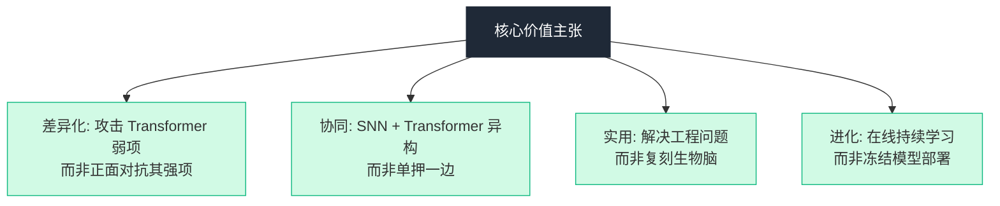
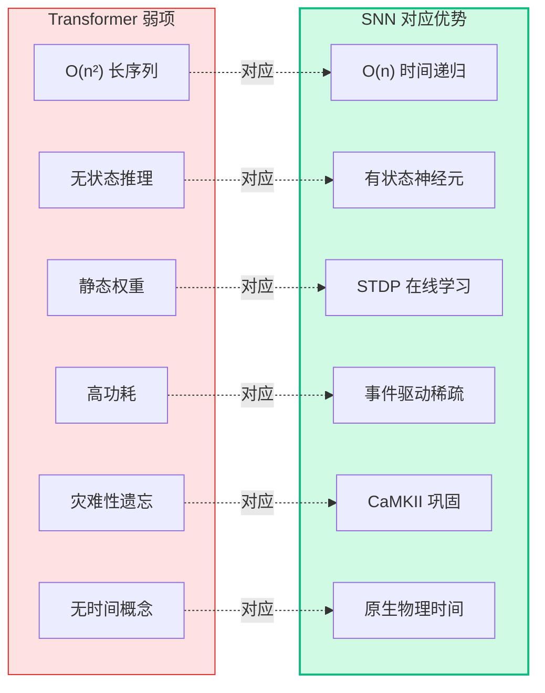
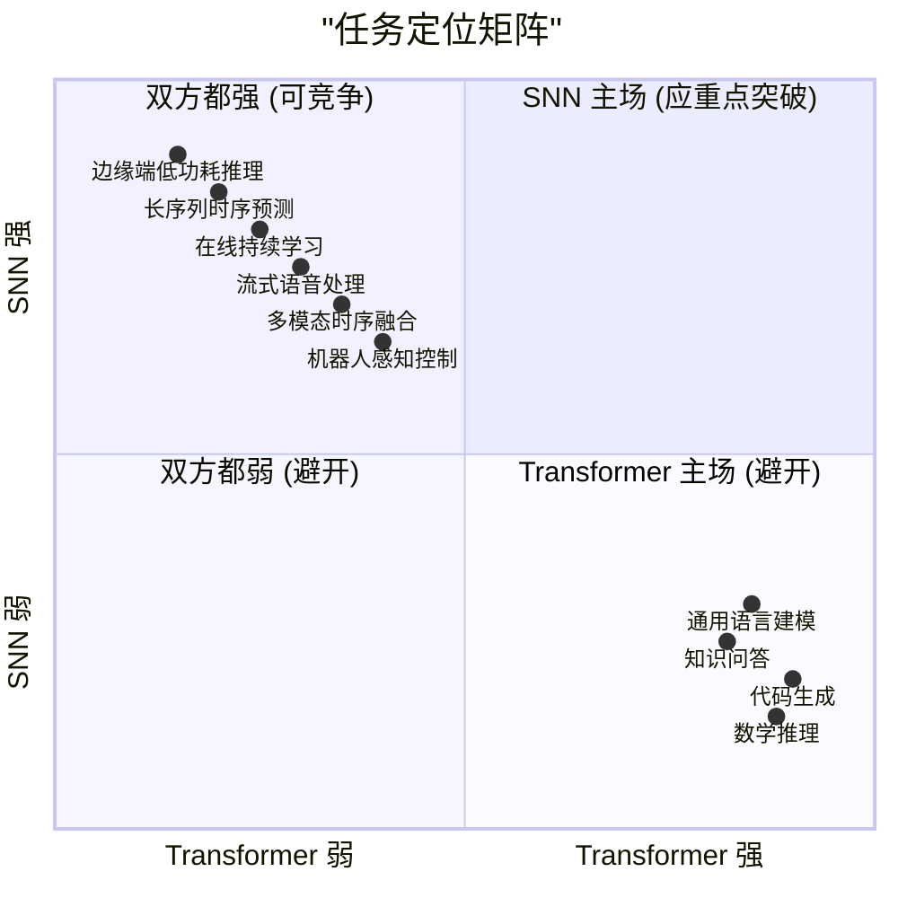
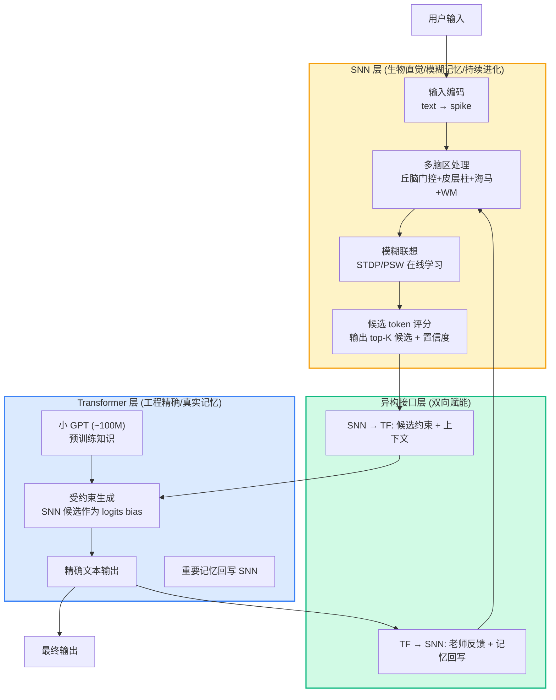
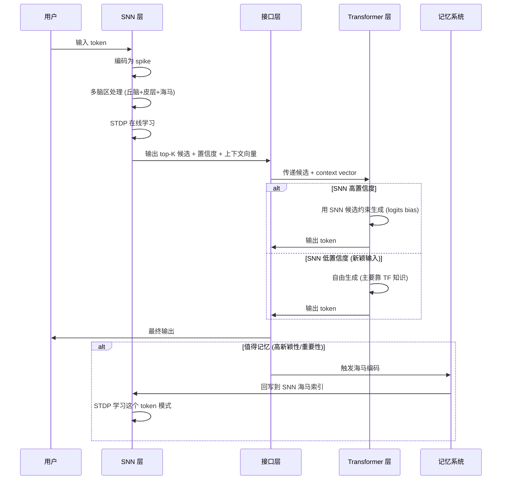
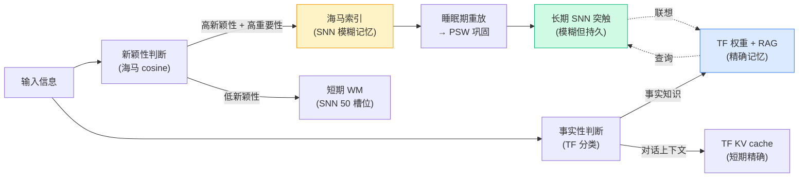
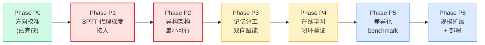
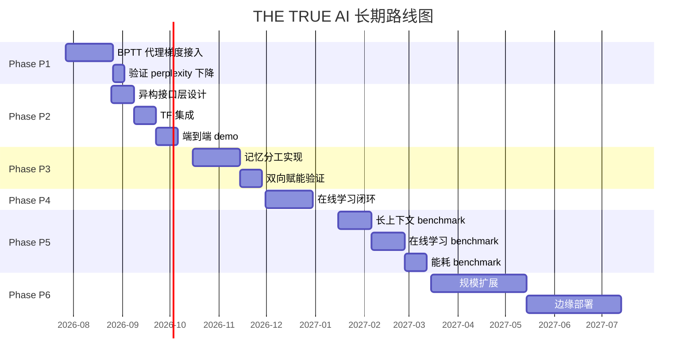
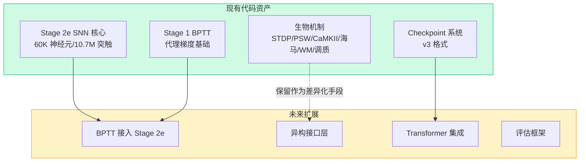
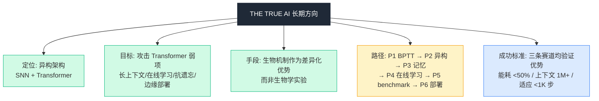

# THE TRUE AI 长期方向计划

> 文档版本: v1.0
> 创建日期: 2026-07-26
> 状态: 已批准方向 / 待详细设计
> 适用范围: 项目整体战略规划

---

## 一、项目愿景

### 1.1 一句话定位

> **THE TRUE AI 是用 SNN（生物直觉层）+ Transformer（工程精确层）异构协同的智能系统，SNN 提供"经验与持续进化"，Transformer 提供"知识与精致输出"，通过双向接口实现 1+1>2 的协同,攻击纯 Transformer 在长上下文、在线学习、抗遗忘、边缘部署四个维度的弱项。**

### 1.2 不是什么

| 错误定位 | 正确定位 |
|---|---|
| 通用语言模型竞品（正面硬刚 GPT） | 差异化赛道选择者（攻击 GPT 弱项） |
| 生物学实验（验证机制假设） | 工程竞品（生物机制作为差异化手段） |
| 纯 SNN 替代 Transformer | SNN + Transformer 异构协同 |
| 追求参数规模对标 | 追求特定场景性能优势 |

### 1.3 核心价值主张



---

## 二、核心定位与差异化赛道

### 2.1 Transformer 的真实弱点分析

| 弱点 | 根本原因 | 影响 |
|---|---|---|
| **长序列爆炸** | O(n²) 注意力计算 | 上下文上限 ~128K tokens |
| **无状态推理** | 每次从零开始（除 KV cache） | 首 token 延迟高 |
| **静态权重** | 部署后无法学习 | 需重训适应新数据 |
| **高功耗** | 稠密 matmul | 推理 100W+ |
| **灾难性遗忘** | BPTT 覆盖旧权重 | 学新忘旧 |
| **无原生时间概念** | 位置编码模拟 | 时序任务需 hack |

### 2.2 SNN 的天然差异化优势



### 2.3 三条差异化赛道

| 赛道 | SNN 优势 | Transformer 短板 | 目标场景 |
|---|---|---|---|
| **长序列时序处理** | O(n) 递归，理论无限上下文 | O(n²) 爆炸，128K 上限 | 长文档/长对话/代码仓库 |
| **在线持续学习** | STDP 实时更新，抗遗忘 | 需重训，灾难性遗忘 | 个性化助手/适应环境 |
| **边缘端低功耗** | 事件驱动 ~1W | 100W+ | IoT/可穿戴/机器人 |

### 2.4 定位矩阵



---

## 三、异构架构设计

### 3.1 架构总览



### 3.2 各层职责分工

#### SNN 层职责

| 职责 | 实现机制 | 工程价值 |
|---|---|---|
| 模糊记忆 | 海马索引 50K + WM 50 槽位 + PSW 概率突触 | 印象式记忆，可联想 |
| 持续进化 | STDP/CaMKII 实时更新 | 边推理边学习 |
| token 真实性选择 | 运动皮层 + 解码器 top-K 候选 | 基于经验判断合理性 |
| 上下文压缩 | 神经元状态持续演化 | 替代 KV cache，O(n) 长上下文 |
| 新颖性检测 | 海马 cosine 匹配 | 判断是否需要长期存储 |
| 调质门控 | DA/ACh/NE 系统 | 控制学习率和记忆强度 |

#### Transformer 层职责

| 职责 | 实现机制 | 工程价值 |
|---|---|---|
| 精致文本输出 | 预训练 GPT (~100M) | 流畅、语法正确 |
| 真实记忆 | 精确权重 + RAG | 事实性知识不变形 |
| 约束生成 | SNN top-K 作为 logits bias | 输出符合经验 |
| 知识检索 | 外挂向量库 | 精确事实查询 |
| 回写记忆 | 重要输出 → SNN 海马编码 | SNN 学习 TF 模式 |

#### 接口层职责（核心创新）

| 方向 | 数据 | 作用 |
|---|---|---|
| SNN → TF | top-K 候选 + 置信度 + 上下文向量 | 约束 TF 生成 |
| TF → SNN | 输出 token + 损失 + 重要性评分 | 驱动 SNN 学习 |

### 3.3 数据流时序



### 3.4 分工式记忆系统



---

## 四、分阶段路线图

### 4.1 总览



### 4.2 Phase P0：方向校准（已完成）

**目标**：明确项目定位，从"生物学实验"转向"工程竞品"

**成果**：
- ✅ 明确异构架构方向（SNN + Transformer）
- ✅ 明确三条差异化赛道
- ✅ 明确生物机制的新角色（手段而非目的）
- ✅ 归档旧的差距评估文档

### 4.3 Phase P1：BPTT 代理梯度接入（关键转折）

**目标**：解决 SNN 训练算法瓶颈，从纯 STDP 切换到 BPTT 代理梯度

**为什么关键**：纯 STDP 信号微弱，无法支撑序列级学习。Stage 1 已实现 BPTT 基础（[src/stage1/bptt_kernels.cuh](file:///f:/项目/THE%20TRUE%20AI/src/stage1/bptt_kernels.cuh)），需移植到 Stage 2e。

**任务清单**：
- [ ] 复用 stage1 BPTT forward/backward kernel
- [ ] 实现 sigmoid/surrogate gradient 替代 spike 不可导
- [ ] 损失函数：next-token cross-entropy（与 Transformer 对齐）
- [ ] 保留 STDP 作为在线学习辅助机制
- [ ] 验证：next-token perplexity 显著下降

**验收标准**：
- 单步预测 perplexity 从 ~5+ 降到 ~3
- 训练 100K 步后 loss 稳定下降
- STDP 与 BPTT 共存不冲突

### 4.4 Phase P2：异构架构最小可行（核心创新）

**目标**：跑通 SNN + Transformer 端到端 demo

**任务清单**：
- [ ] 新建 `src/hybrid/` 目录
- [ ] 实现异构接口层 `HybridInterface` 数据结构
- [ ] 集成小 GPT（推荐 distilgpt2 82M 或 gpt2-small 124M）
- [ ] SNN → TF：top-K 候选作为 logits bias
- [ ] TF → SNN：输出 token 触发 eligibility 更新
- [ ] 端到端 demo：输入 → SNN 处理 → TF 生成 → 输出

**架构决策**：
```
TF 模型选择:
  方案 A: distilgpt2 (82M) - 推荐, 蒸馏版, CPU 可跑
  方案 B: gpt2-small (124M) - 原版, 需 GPU
  方案 C: 自训小模型 - 长期考虑, 短期不推荐

部署方式:
  - TF 在 CPU 运行 (不抢 SNN 的 GPU)
  - 或 TF 在独立 GPU 流 stream 运行
  - 接口层用共享内存或 IPC
```

**验收标准**：
- 端到端 demo 可运行
- SNN top-K 候选能影响 TF 输出
- TF 输出能回写 SNN
- 延迟可接受（<1s/token）

### 4.5 Phase P3：记忆分工与双向赋能

**目标**：实现 SNN 模糊记忆 + TF 精确记忆的分工式存储

**任务清单**：
- [ ] 海马新颖性检测 → 判断是否记忆
- [ ] TF 输出重要性评分 → 决定回写强度
- [ ] 睡眠期：SNN 重放 + TF 知识蒸馏
- [ ] 长期记忆：PSW 巩固 + TF RAG 检索
- [ ] 上下文管理：SNN WM 替代部分 KV cache

**验收标准**：
- 重要信息能被 SNN 长期记忆
- 事实知识能被 TF 精确存储
- 睡眠期能巩固记忆
- 抗遗忘能力优于纯 TF 微调

### 4.6 Phase P4：在线学习闭环验证

**目标**：验证 SNN 持续学习 + TF 周期更新的协同

**任务清单**：
- [ ] 用户交互 → SNN 实时 STDP 学习
- [ ] SNN 学习模式 → 影响 TF 生成约束
- [ ] TF 纠正 → SNN eligibility 更新
- [ ] 评估：在线学习 vs 冻结模型的适应能力对比

**验收标准**：
- 新任务适应速度优于 TF 微调
- 学习新知识不遗忘旧知识
- 用户个性化能力可验证

### 4.7 Phase P5：差异化 benchmark

**目标**：在三条赛道上验证相对 Transformer 的优势

**任务清单**：
- [ ] 长上下文测试：1M+ tokens（SNN 压缩）vs 128K（TF KV cache）
- [ ] 在线学习测试：新任务适应速度
- [ ] 能耗测试：异构 vs 纯 TF
- [ ] 输出质量：perplexity + 人工评估

**验收标准**：
- 长上下文：1M tokens 可处理，TF 显存不爆
- 在线学习：新任务 <1K 步适应
- 能耗：异构 < 纯 TF 的 50%
- 输出质量：perplexity 不显著低于纯 TF

### 4.8 Phase P6：规模扩展与部署

**目标**：扩大规模 + 边缘端部署

**任务清单**：
- [ ] SNN 规模：60K → 1M 神经元（DGX Spark 32GB）
- [ ] TF 规模：124M → 350M（保持 CPU 可跑）
- [ ] 量化：spike 事件 → INT8/二值化
- [ ] 部署：边缘端推理（Loihi/SpiNNaker/纯 CUDA）
- [ ] 对标：同参数量 Transformer 的功耗/延迟

**验收标准**：
- 1M 神经元规模可训练
- 边缘端推理 <5W
- 同参数量下功耗/延迟优于 Transformer

---

## 五、技术栈选择

### 5.1 SNN 层技术栈

| 组件 | 技术 | 说明 |
|---|---|---|
| 核心计算 | CUDA C++ | 已有 Stage 2e 代码基础 |
| 训练算法 | BPTT 代理梯度 + STDP | Phase P1 切换 |
| 框架 | 自研（无 PyTorch 依赖） | 保持零框架依赖原则 |
| 构建 | CMake | 已有跨平台配置 |
| 部署 | CUDA / Loihi / SpiNNaker | 长期目标 |

### 5.2 Transformer 层技术栈

| 组件 | 技术 | 说明 |
|---|---|---|
| 模型 | distilgpt2 / gpt2-small | 短期方案 |
| 推理引擎 | HuggingFace Transformers | 快速集成 |
| 部署优化 | ONNX Runtime / llama.cpp | 长期优化 |
| 知识库 | FAISS + 向量数据库 | RAG 支持 |

### 5.3 接口层技术栈

| 组件 | 技术 | 说明 |
|---|---|---|
| 进程间通信 | 共享内存 / IPC | 低延迟 |
| 数据序列化 | Protobuf / FlatBuffers | 高效跨语言 |
| 语言绑定 | C++ ↔ Python | pybind11 / ctypes |

### 5.4 评估与部署

| 组件 | 技术 | 说明 |
|---|---|---|
| 评估框架 | 自研 + lm-eval-harness | 标准化对比 |
| 监控 | Prometheus + Grafana | 训练监控 |
| 部署 | Docker + CUDA | 容器化 |

---

## 六、评估指标体系

### 6.1 任务性能指标

| 指标 | 当前基线 | Phase P5 目标 | 对标 Transformer |
|---|---|---|---|
| next-token perplexity | ~5+ | <3 | GPT-2 small ~3 |
| 长上下文处理能力 | 未验证 | 1M tokens | 128K tokens |
| 在线学习适应步数 | 未验证 | <1K 步 | 需微调 ~10K 步 |
| 输出流畅性 | 未验证 | 人工评估 >4/5 | GPT-2 ~4.5/5 |

### 6.2 工程性能指标

| 指标 | 当前 | Phase P6 目标 | 对标 Transformer |
|---|---|---|---|
| 推理延迟 | ~1ms/step | <10ms/token | GPT-2 ~30ms/token |
| 推理功耗 | GPU 全载 | <5W（边缘） | 100W+ |
| 显存占用 | ~1.3GB | <8GB（1M 神经元） | GPT-2 ~2GB |
| 训练显存 | ~2GB | <32GB | GPT-2 ~8GB |

### 6.3 差异化能力指标

| 指标 | 验证方法 | 目标 |
|---|---|---|
| 长上下文保持 | 1M tokens 后回忆准确率 | >60% |
| 在线学习无遗忘 | 学新任务后旧任务准确率 | >90% |
| 个性化适应 | 用户交互 1K 步后偏好匹配 | >70% |
| 能效比 | tokens/Joule | >10× Transformer |

---

## 七、风险评估与缓解

### 7.1 技术风险

| 风险 | 概率 | 影响 | 缓解方案 |
|---|---|---|---|
| SNN top-K 候选质量低 | 高 | 高 | 先用 SNN 做"抑制"而非"提升" |
| TF 与 SNN 冲突 | 中 | 高 | confidence 阈值，低置信度 TF 自由生成 |
| 接口延迟过高 | 中 | 中 | SNN 和 TF 并行执行，late binding |
| BPTT 代理梯度不稳定 | 中 | 高 | 学习率调度 + 梯度裁剪 |
| 训练复杂度过高 | 中 | 中 | 分阶段：先冻结 TF 训 SNN，再联合 |

### 7.2 工程风险

| 风险 | 概率 | 影响 | 缓解方案 |
|---|---|---|---|
| C++ ↔ Python 集成复杂 | 高 | 中 | 优先用 pybind11，备选 ONNX |
| TF 模型选择不当 | 中 | 中 | 从 distilgpt2 起步，验证后再扩大 |
| 显存不足 | 中 | 高 | SNN 在 GPU，TF 在 CPU，分设备 |
| 部署难度大 | 高 | 中 | 长期目标，短期聚焦 demo |

### 7.3 战略风险

| 风险 | 概率 | 影响 | 缓解方案 |
|---|---|---|---|
| Transformer 长上下文快速进步 | 高 | 高 | 持续关注，及时调整赛道 |
| SNN 硬件生态不成熟 | 高 | 中 | 不依赖专用硬件，纯 CUDA 也能跑 |
| 差异化优势不显著 | 中 | 高 | 聚焦在线学习 + 抗遗忘，这是 Transformer 难以解决的 |

---

## 八、关键决策记录

### ADR-001: 选择异构架构而非纯 SNN

**状态**：已接受
**背景**：纯 SNN 在精确输出和知识存储上无法与 Transformer 竞争
**决策**：采用 SNN + Transformer 异构架构，SNN 负责模糊记忆/持续进化，TF 负责精确输出/真实记忆
**后果**：增加系统复杂度，但获得 1+1>2 的协同效应

### ADR-002: 主训练算法从纯 STDP 切换到 BPTT 代理梯度

**状态**：已接受
**背景**：纯 STDP 信号微弱，无法支撑序列级学习，任务性能差距大
**决策**：主训练算法采用 BPTT 代理梯度，STDP 作为在线学习辅助
**后果**：训练复杂度增加，但任务性能可对标 Transformer

### ADR-003: 短期使用 HuggingFace Transformers 而非自训

**状态**：已接受
**背景**：自训 Transformer 成本高，短期需快速验证异构架构
**决策**：短期使用 distilgpt2/gpt2-small，长期考虑自训或微调
**后果**：依赖外部模型，但可快速验证架构

### ADR-004: 生物机制作为差异化手段而非目的

**状态**：已接受
**背景**：项目定位从"生物学实验"转向"工程竞品"
**决策**：生物机制（STDP/CaMKII/海马/调质）重新定位为差异化优势的来源
**后果**：不再追求生物学一致性，聚焦工程竞争力

---

## 九、里程碑与时间规划

### 9.1 里程碑总览



### 9.2 短期里程碑（3 个月内）

| 里程碑 | 目标日期 | 验收标准 |
|---|---|---|
| BPTT 代理梯度接入 | 2026-08-25 | perplexity <3 |
| 异构架构 demo | 2026-09-30 | 端到端可运行 |
| 记忆分工验证 | 2026-10-30 | SNN/TF 记忆分工有效 |

### 9.3 中期里程碑（6-12 个月）

| 里程碑 | 目标日期 | 验收标准 |
|---|---|---|
| 在线学习闭环 | 2026-12-30 | 新任务 <1K 步适应 |
| 长上下文 benchmark | 2027-02-15 | 1M tokens 可处理 |
| 能耗 benchmark | 2027-03-15 | 异构 <50% 纯 TF |

### 9.4 长期里程碑（12-24 个月）

| 里程碑 | 目标日期 | 验收标准 |
|---|---|---|
| 1M 神经元规模 | 2027-06-30 | 可训练 |
| 边缘端部署 | 2027-09-30 | <5W 推理 |
| 完整差异化验证 | 2027-12-30 | 三条赛道均验证优势 |

---

## 十、与现有项目的关系

### 10.1 现有 Stage 2e 代码的定位



### 10.2 现有生物机制的重新定位

| 生物机制 | 原定位 | 新定位 |
|---|---|---|
| STDP/PSW | 主训练算法 | 在线学习辅助 + 抗遗忘 |
| CaMKII | 生物学验证目标 | 抗遗忘机制 |
| 海马重放 | 神经科学实验 | 离线巩固 + 记忆回写 |
| 调质系统 | 生物学复刻 | 任务驱动学习率调制 |
| 柱状皮层 | 解剖学仿真 | 高效局部计算 + 稀疏激活 |
| WM 50 槽位 | 认知科学模型 | 工作记忆（替代部分 KV cache） |

### 10.3 不放弃的部分

- ✅ Stage 2e SNN 核心架构（多脑区 + 柱状皮层）
- ✅ 生物机制实现（重新定位为差异化手段）
- ✅ Checkpoint 系统
- ✅ 跨平台构建（CMake）
- ✅ 零框架依赖原则（SNN 层）

---

## 十一、成功标准

### 11.1 短期成功（6 个月）

- [ ] BPTT 代理梯度接入完成，perplexity <3
- [ ] 异构架构 demo 可运行
- [ ] SNN + TF 双向赋能验证有效

### 11.2 中期成功（12 个月）

- [ ] 在线学习闭环：新任务 <1K 步适应
- [ ] 长上下文：1M tokens 可处理
- [ ] 抗遗忘：学新不忘旧 >90% 保留
- [ ] 能耗：异构 <50% 纯 TF

### 11.3 长期成功（24 个月）

- [ ] 1M 神经元规模可训练
- [ ] 边缘端 <5W 推理
- [ ] 三条差异化赛道均验证优势
- [ ] 完整工程化部署方案

---

## 十二、最简洁的总结



**一句话总结**：

> **用 SNN 的生物直觉（模糊记忆/持续进化/token 选择）+ Transformer 的工程精确（精致输出/真实记忆），通过异构协同攻击纯 Transformer 在长上下文、在线学习、抗遗忘、边缘部署的弱项，做差异化工程竞品而非生物学实验。**

---

## 附录 A：相关文档索引

- [CODE_WIKI.md](file:///f:/项目/THE%20TRUE%20AI/CODE_WIKI.md) - 项目代码 Wiki
- [人类脑差距评估.md](file:///f:/项目/THE%20TRUE%20AI/人类脑差距评估.md) - 与人脑差距评估
- [docs/superpowers/specs/2026-07-19-bio-mechanisms-design.md](file:///f:/项目/THE%20TRUE%20AI/docs/superpowers/specs/2026-07-19-bio-mechanisms-design.md) - 生物机制设计
- [docs/archive/human-brain-gap-assessment-2026-07-24/](file:///f:/项目/THE%20TRUE%20AI/docs/archive/human-brain-gap-assessment-2026-07-24/) - 旧版差距评估归档

## 附录 B：术语表

| 术语 | 含义 |
|---|---|
| SNN | Spiking Neural Network，脉冲神经网络 |
| TF | Transformer |
| BPTT | Backpropagation Through Time，时间反向传播 |
| STDP | Spike-Timing-Dependent Plasticity，脉冲时序依赖可塑性 |
| PSW | Probabilistic Synaptic Weights，概率突触权重 |
| CaMKII | Ca²⁺/Calmodulin-dependent protein kinase II |
| WM | Working Memory，工作记忆 |
| RAG | Retrieval-Augmented Generation，检索增强生成 |
| KV cache | Transformer 的 Key-Value 缓存 |
| logits bias | 对 Transformer logits 加偏置以约束生成 |
